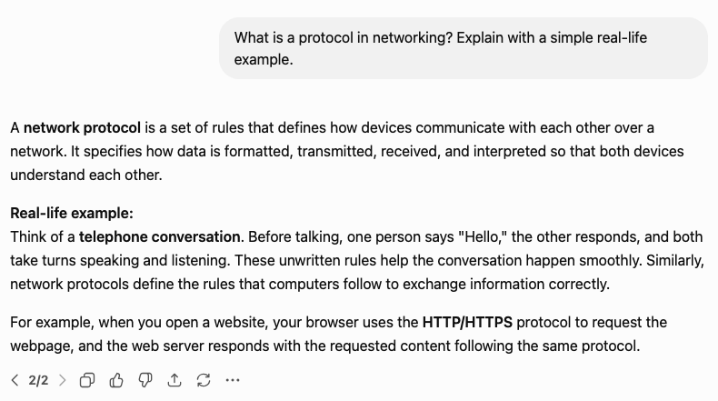
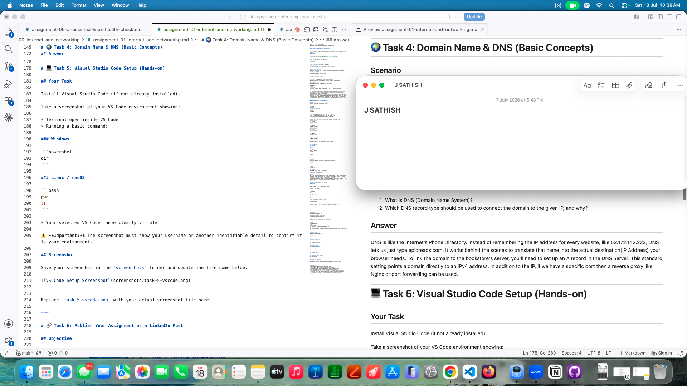

# Week 00 - Internet and Networking

Part of the DevOps Micro Internship (DMI) Cohort 3 with Agentic AI

---

# 🧑‍💻 Task 1: Using ChatGPT as Your Learning Assistant

## Scenario

You're new to DevOps and will frequently encounter technical questions. ChatGPT can be your learning companion.

## Your Task

Write a clear ChatGPT prompt to help you understand:

> "What is a protocol in networking? Explain with a simple real-life example."

Take a screenshot of your interaction showing:

* Your detailed prompt (with clear expectations)
* ChatGPT's simplified response with an example

## Screenshot

Save your screenshot in the `screenshots` folder and update the file name below.




Replace `task-1-chatgpt.png` with your actual screenshot file name.

---

## What I Learned (2–3 lines)

A **network protocol** is a set of rules that allows devices to communicate and exchange data correctly over a network.

**Example:** Just like people follow rules during a phone conversation, computers follow protocols like **HTTP** to send and receive web pages.

---

# 🌐 Task 2: Internet and Networking

## Scenario

Your friend is launching an online bookstore named **EpicReads**.

He asked you to explain how users globally can access his website hosted in Finland.

## Your Task

Write a short explanation (**100–150 words**) that includes:

* Packet Switching
* IP Address
* TCP/IP
* HTTP/HTTPS

💡 **Tip:** You may use ChatGPT (as demonstrated in Task 1) to refine your explanation.

## Answer

The global accessibility of EpicReads relies on a structured, layered network architecture. When a user requests the website, HTTPS establishes a secure, encrypted connection to prevent data tampering. To locate the website's server in Finland, the network uses the server's unique IP Address, acting as a digital destination marker.
Data is then transmitted using the TCP/IP protocol suite. While IP handles the routing of data across the internet, TCP ensures that the communication is stable and error-free. This data does not travel as a single file; instead, Packet Switching breaks the information into smaller packets that travel independently across the most efficient network paths. Once they reach the user's device, they are rapidly reassembled. Together, these technologies ensure that accessing the website is fast, secure, and reliable from anywhere in the world.

---

# 🏗️ Task 3: Application Architecture & Stack

## Scenario

EpicReads bookstore has two application versions:

### Two-Tier Application

* Frontend
* Database

### Three-Tier Application

* Frontend
* Backend
* Database

## Your Task

* Draw simple diagrams (hand-drawn or tool-based such as draw.io)
* Label each layer clearly
* List at least two common technologies or tools used for each layer
* Submit a screenshot or photo clearly showing your own drawing

## Diagram Screenshot / Photo

Save your diagram image in the `screenshots` folder and update the file name below.

+------------------+
|    Frontend      |
| (React, Angular) |
+------------------+
          |
          |
+------------------+
|    Database      |
| (MySQL, PostgreSQL) |
+------------------+

+------------------+
|    Frontend      |
| (React, Angular) |
+------------------+
          |
          |
+------------------+
|     Backend      |
| (Node.js, Django)|
+------------------+
          |
          |
+------------------+
|    Database      |
| (MySQL, PostgreSQL) |
+------------------+

---

## Technologies Used

### Frontend

* React
* Angular

### Backend

* Node.js (Express)
* Django

### Database

* MySQL
* PostgreSQL

---

# 🌍 Task 4: Domain Name & DNS (Basic Concepts)

## Scenario

Your friend's bookstore **EpicReads** is currently accessible through:

```text
52.172.142.222:3000
```

He purchased the domain:

```text
epicreads.com
```

## Your Task

In **50–100 words**, explain in your own words:

1. What is DNS (Domain Name System)?
2. Which DNS record type should be used to connect the domain to the given IP, and why?

## Answer

DNS is like the Internet’s Phone Directory. Instead of remembering the IP address for every website, like 52.172.142.222, DNS lets us just type epicreads.com. It works behind the scenes to translate that name into the actual destination(IP Address) your browser needs.
To link the domain to the bookstore's server, you'll need to set up an A record in the DNS Server. This standard setting points a domain directly to an IPv4 address. In addition to the IP, if we have a specific port then a reverse proxy like Nginx or port forwarding can be used.

---

# 💻 Task 5: Visual Studio Code Setup (Hands-on)

## Your Task

Install Visual Studio Code (if not already installed).

Take a screenshot of your VS Code environment showing:

* Terminal open inside VS Code
* Running a basic command:

### Windows

```powershell
dir
```

### Linux / macOS

```bash
pwd
ls
```

* Your selected VS Code theme clearly visible

⚠️ **Important:** The screenshot must show your username or another identifiable detail to confirm it is your environment.

## Screenshot

Save your screenshot in the `screenshots` folder and update the file name below.




Replace `task-5-vscode.png` with your actual screenshot file name.

---

# 🔗 Task 6: Publish Your Assignment as a LinkedIn Post

## Objective

Publishing on LinkedIn helps you:

* Build your professional online presence
* Reinforce your learning
* Document your DevOps journey publicly

## Your Task

Summarize your answers from Tasks 1–5 into a LinkedIn post.

Clearly structure your post into the following sections:

* ChatGPT
* Internet & Networking
* App Architecture
* DNS
* VS Code Setup

Add the following credit note at the end of your post:

> **P.S. This post is a part of DevOps Micro Internship with Agentic AI Cohort-3 by Pravin Mishra. You can start your DevOps journey by joining this Discord community: https://discord.pravinmishra.com/**

---

## LinkedIn Post URL

Paste your LinkedIn post URL here:

https://www.linkedin.com/posts/sathish-j-80276569_devops-micro-internship-dmi-by-pravin-activity-7462532113330958337--dll?utm_source=share&utm_medium=member_desktop&rcm=ACoAAA6HMEIBTonD7eyzNj3QgU56nWdszIj2pg0

---

## LinkedIn Post Backup Copy

Paste the full text of your LinkedIn post here:

DevOps Micro Internship CoHort 3 (Week-0 Recap Summary)
As part of my DevOps learning journey, I completed Tasks 1–5 covering key foundational concepts:

Assignment 1 (ChatGPT) :
 I used ChatGPT as a learning assistant to simplify complex DevOps and networking concepts, making them easier to understand with real-life examples. Also, had prompted ChatGPT for Pictorial representation as well.

Assignment 2 (Internet & Networking):

The global accessibility of EpicReads relies on a structured, layered network architecture. When a user requests the website, HTTPS establishes a secure, encrypted connection to prevent data tampering. To locate the website's server in Finland, the network uses the server's unique IP Address, acting as a digital destination marker.
Data is then transmitted using the TCP/IP protocol suite. While IP handles the routing of data across the internet, TCP ensures that the communication is stable and error-free. This data does not travel as a single file; instead, Packet Switching breaks the information into smaller packets that travel independently across the most efficient network paths. Once they reach the user's device, they are rapidly reassembled. Together, these technologies ensure that accessing the website is fast, secure, and reliable from anywhere in the world.

Assignment 3 (App Architecture):
I explored two-tier and three-tier architectures, understanding how frontend, application layer (Backend), and database layers interact, along with common technologies used in each layer.

Assignment 4 (DNS):
DNS is like the Internet’s Phone Directory. Instead of remembering the IP address for every website, like 52.172.142.222, DNS lets us just type epicreads.com. It works behind the scenes to translate that name into the actual destination(IP Address) your browser needs.
To link the domain to the bookstore's server, you'll need to set up an A record in the DNS Server. This standard setting points a domain directly to an IPv4 address. In addition to the IP, if we have a specific port then a reverse proxy like Nginx or port forwarding can be used.

Assignment 5 (VS Code):
I installed and configured Visual Studio Code, opened the terminal, and executed basic commands, preparing my development environment for future tasks.

P.S. This post is part of the FREE DevOps Micro Internship Cohort run by Pravin Mishra (https://lnkd.in/grBi4w7p) . You can start your DevOps journey for free from his YouTube Playlist (https://lnkd.in/gUQBE5Ry).

---

# Reflection – Week 0

### What did you find easy?

Using ChatGPT to break down complex networking concepts into simple, real-world examples made foundational learning much easier. Creating application architecture diagrams was intuitive once I understood the layer separation, and VS Code setup was straightforward with clear documentation.

---

### What was difficult?

Grasping the intricacies of how TCP/IP, packet switching, and DNS all work together took time to fully internalize. Explaining networking concepts in simple terms without oversimplifying was challenging, and understanding why certain DNS record types are used over others required deeper research beyond the assignment.

---

### What will you improve next week?

I'll dive deeper into hands-on networking labs to reinforce theoretical concepts with practical implementation. I want to get more comfortable with terminal commands and explore how DNS configuration works in real environments. Building stronger fundamentals now will help me tackle more complex DevOps challenges ahead.

---

## 📌 About DMI & CloudAdvisory

DevOps Micro Internship (DMI) is a project-based DevOps program run by Pravin Mishra (The CloudAdvisory) focused on real-world execution, systems thinking, and career readiness.

It helps learners build strong DevOps foundations with hands-on experience.


## 📌 Resources

- 🌐 **DMI Official Website:** https://pravinmishra.com/dmi  
- 🎓 **DevOps for Beginners (Udemy):** https://www.udemy.com/course/devops-for-beginners-docker-k8s-cloud-cicd-4-projects/  
- 🎓 **Ultimate Agentic AI DevOps with Clude Code** https://www.udemy.com/course/ultimate-agentic-ai-devops-with-claude-code/?referralCode=448389767BC96284087B
- 🎓 **DevOps with Claude Code: Terraform, EKS, ArgoCD & Helm** https://www.udemy.com/course/devops-with-claude-code-terraform-eks-argocd-helm/?referralCode=1C5B734505D65A010FA3
- ▶️ **YouTube Playlist (DMI Cohort 3):** https://www.youtube.com/playlist?list=PLFeSNDtI4Cho  
- 🔗 **Pravin Mishra (LinkedIn):** https://www.linkedin.com/in/pravin-mishra-aws-trainer/  
- 🏢 **CloudAdvisory (LinkedIn):** https://www.linkedin.com/company/thecloudadvisory/

---

*This submission is part of DevOps Micro Internship (DMI) Cohort 3 — Agentic AI Track*