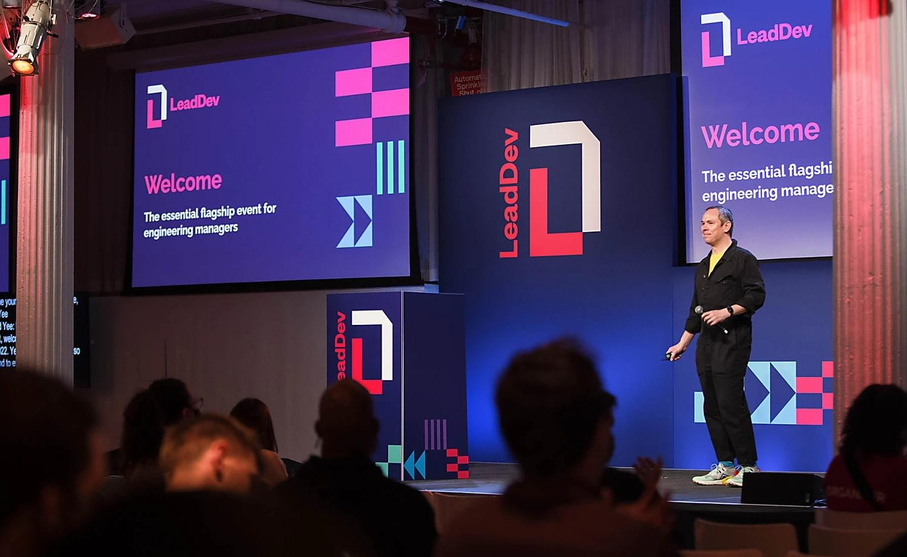

# Week 01 — Success Mindset (Mindset OS)

Part of the DevOps Micro Internship (DMI) Cohort 3 with Agentic AI

---

## Purpose (Read This First)

This week is not motivation homework.

This is you building your **Mindset OS** — the system you will use for the next 5 months (and honestly, for years).

### Expectations

* Be honest.
* Be specific.
* Be practical.
* Write like an adult professional: clear sentences, no one-liners.

You will reuse this in later weeks. So do it properly once.

---

# Assignment 1. What is something you believe to be true that most people around you would disagree with?

### Rules

* No "safe" answers.
* Must be your real belief (not copied from internet).
* Minimum 50 words.

**Hint:** What do you believe about career, money, learning, discipline, relationships, health, success, life, tech industry, etc. that most people don't agree with?

## Answer

One belief I hold that many people around me disagree with is that you should start investing from your very first paycheck. Your 20s are for building memories and enjoying life, but setting aside even a small portion of your income from day one creates financial freedom, long-term security, and the power of compounding.

---

# Assignment 2. What are the top 3 objective truths you discovered through experimentation and results?

### Definition

Objective truths do not depend on opinions. They hold true regardless of how people feel.

Write each truth in this format:

**Truth:** (1 sentence)

**Evidence from my life:** (2–4 lines: what you tried + what happened)

---

## Truth #1

### Truth

Instead of trying to beat the market, I've learned that simply owning the market is often the smarter and more reliable investment strategy.

### Evidence from my life

I used to randomly invest in large-cap and small-cap mutual funds, believing they would outperform. Over time, most of them lagged behind simple index funds. That experience taught me that consistently investing in low-cost index funds often beats trying to outsmart the market, regardless of how knowledgeable you think you are.

---

## Truth #2

### Truth

Weight training is equaly important as cardio exercises. 

### Evidence from my life

I realized later in life that weight training is one of the best long-term investments in health. Regular resistance training strengthens muscles, bones, and joints, improves mobility, and reduces the risk of injuries and chronic pain as we age. I only wish I had started much earlier.

---

## Truth #3

### Truth

Get used to Linux environments much early in one's carrer.

### Evidence from my life

Learning and practising Linux OS, scripting and automating fewer things in linux earlier in the career definitely helps. I started focusing a bit late, but still caught up with Linux.

---

# Assignment 3. What does your 2.0 version look like?

### Instructions

Write as if a journalist is writing about you **3 to 7 years from now** (not 20 years).

**Minimum 300 words.**

### Rules

* Write in past tense, like it already happened.
* Don't use "likes to / wants to / hopes to."
* Use specifics:

  * built
  * shipped
  * led
  * published
  * earned
  * relocated
  * contributed
* Include skills proof:

  * projects
  * portfolios
  * GitHub
  * blogs
  * certifications
  * job role
  * leadership
  * community contribution
* Add 1–3 images if you can (optional but powerful).

### Publish It Publicly On Any ONE

* LinkedIn
* Medium
* WordPress
* Blogspot
* Personal blog
* Portfolio page

Include this line:

> **P.S. This post is a part of DevOps Micro Internship with Agentic AI Cohort-3 by [Pravin Mishra](https://www.linkedin.com/in/pravin-mishra-aws-trainer/). You can start your DevOps journey by joining this [Discord community](https://discord.pravinmishra.com/) ( https://discord.pravinmishra.com/ ).**

## Your Article

The Platform Engineer Who Built the Foundations of Modern Software Delivery
Over the course of just a few years, Sathish J established himself as one of the most respected Platform Engineering leaders in the DevOps industry. What began as a strong technical foundation evolved into a career defined by innovation, leadership, and measurable business impact. His ability to bridge software engineering, cloud infrastructure, automation, and developer experience earned him recognition as a trusted technology leader whose work influenced not only products but also engineering culture.

Sathish built numerous production-grade DevOps pipelines for enterprise projects, transforming the way software was developed, tested, secured, and deployed. His CI/CD implementations reduced deployment times, improved release quality, strengthened security practices, and enabled engineering teams to deliver software with greater confidence. Every pipeline he designed emphasized automation, scalability, and reliability, becoming a reusable foundation for multiple engineering organizations.

His contributions extended far beyond automation. Sathish successfully shipped many products as platforms by designing Internal Developer Platforms that empowered developers with self-service infrastructure, standardized deployment workflows, integrated observability, policy-driven security, and Infrastructure as Code. These platforms significantly improved developer productivity and accelerated product delivery while reducing operational overhead across multiple business units.

His consistent delivery of high-impact solutions naturally led to his appointment as a Lead Engineer, where he led a high-performing Platform Engineering team. Under his leadership, engineers adopted cloud-native best practices, Kubernetes-based deployments, GitOps workflows, and modern Platform Engineering principles. He fostered a culture of ownership, collaboration, continuous learning, and technical excellence, helping team members grow into confident engineers while consistently delivering complex enterprise initiatives.

His technical expertise was supported by an impressive body of work. His professional portfolio showcased multiple enterprise Platform Engineering projects, production-ready DevOps architectures, Kubernetes deployments, Infrastructure as Code implementations, and automation frameworks. His GitHub profile became a valuable resource for engineers worldwide, featuring reusable CI/CD templates, Kubernetes manifests, Terraform modules, GitOps examples, automation scripts, and practical DevOps reference implementations. These open repositories demonstrated not only technical depth but also a commitment to sharing knowledge with the broader engineering community.

Sathish actively contributed to numerous open-source projects, collaborating with developers across the globe to improve cloud-native tools and automation frameworks. His contributions were recognized by maintainers and fellow engineers alike, strengthening his reputation within the international DevOps and Kubernetes communities.

Beyond writing code, Sathish became a respected technical author. He published numerous whitepapers covering Platform Engineering, Kubernetes, GitOps, Infrastructure as Code, cloud-native architectures, AI-assisted DevOps, developer platforms, and engineering best practices. His technical blogs translated complex engineering concepts into practical implementation guides that were widely read by Platform Engineers, DevOps professionals, and engineering leaders. Many organizations adopted ideas inspired by his publications, reinforcing his influence across the industry.

His dedication to continuous learning remained evident throughout his career. Among several professional accomplishments, earning the CKAD (Certified Kubernetes Application Developer) certification validated his advanced Kubernetes expertise and complemented his extensive experience delivering production-grade cloud-native solutions. Combined with his growing portfolio of successful projects, GitHub repositories, technical blogs, published whitepapers, and engineering leadership, his credentials reflected both practical excellence and continuous professional growth.

As his reputation continued to grow, global opportunities followed. Sathish successfully relocated to the United States, where he joined a world-class engineering organization and led platform modernization initiatives serving globally distributed development teams. His experience in building scalable platforms, leading engineering teams, and driving cloud-native transformation enabled organizations to deliver software faster while maintaining exceptional reliability and security.

Perhaps his greatest achievement was the reputation he earned throughout the technology community. Colleagues recognized him as a thoughtful leader, engineers respected him as a mentor, and the wider DevOps community valued his technical contributions, open-source involvement, GitHub portfolio, blogs, and whitepapers. His journey demonstrated that exceptional Platform Engineering was never just about infrastructure—it was about enabling people, accelerating innovation, and building platforms that empowered organizations to succeed at scale.

### Public Link

https://satcse.wordpress.com/2026/07/01/the-platform-engineer-who-built-the-foundations-of-modern-software-delivery/

`__________________________`

---

# Assignment 4. Have you ever cut corners (unethical / dishonest / shortcut behavior — not necessarily illegal)? If yes, how did it make you feel?

### Important

You don't need to write the full story.

Focus on the feeling:

* guilt
* fear
* shame
* stress
* regret
* numbness
* etc.

This is about self-awareness, not judgment.

### Answer Format

*Yes*

If Yes:

**What emotion did you feel?** (minimum 50–100 words)

## Answer

Looking back, I realized that one of the biggest shortcuts I took was not putting in my best effort when valuable career opportunities came my way. Several excellent roles and growth opportunities were presented to me, but I did not fully utilize them or prepare well enough to make the most of them. Instead of taking decisive action, I allowed many of those opportunities to slip away. Although this wasn't unethical or dishonest, it left me with a genuine sense of guilt and regret. That feeling became an important lesson in self-awareness. It reminded me that opportunities are valuable only when matched with commitment, preparation, and consistent action. Since then, I have become much more intentional about investing in my growth, embracing new challenges, and making the most of every opportunity that comes my way.

---

# Assignment 5. What are 10 non-fiction books you plan to read in the next 1 year?

### Rules

* Mention **Title + Author**
* Any language allowed
* No fiction novels

### Tip

Choose books that improve:

* mindset
* communication
* productivity
* health
* money
* career
* leadership

## Book List

1. Mindset by Carol S. Dweck
2. Deep Work by Cal Newport
3. Atomic Habits by James Clear
4. The Psychology of Money by Morgan Housel
5. Rich Dad Poor Dad by Robert T. Kiyosaki
6. Designing Data-Intensive Applications by Martin Kleppmann
7. Cloud Native DevOps with Kubernetes by John Arundel and Justin Domingus
8. Kubernetes Up & Running by Kelsey Hightower, Brendan Burns, and Joe Beda
9. AI Engineering by Chip Huyen
10. Hands-On Large Language Models by Jay Alammar and Maarten Grootendorst

---

# Assignment 6. What are the things you will measure regularly in your life and career?

### Rules

List topics only. No need to share numbers.

### Must Include

* Learning / skill
* Output / proof
* Health / energy
* Time / focus
* Money / finance (personal or business)

### Example

* Learning hours per week
* Deep work sessions per week
* Projects shipped / documented
* Steps / workouts
* Sleep hours
* Spending tracker

## My Metrics

* Deep work sessions per week
* AI and Cloud concepts mastered
* CKAD certification progress
* Technical blogs written
* Health and fitness workouts
* Sleep hours and Quality
* Savings and investments
* Books read
* Mentoring and leadership activities
* Screen time

---

# Assignment 7. Brain Dump + 5-Month System Plan

## Step 1: Brain Dump (Private)

Do a brain dump of everything in your mind into a notebook.

Examples:

* Bills
* Tasks
* Worries
* Goals
* Pending messages
* Ideas
* Responsibilities

### Did You Do It?

YES

Answer:

* Complete the DMI Cohort 3 journey successfully
* Strengthen my DevOps and Platform Engineering skills
* Prepare for the CKAD certification
* Write technical blogs regularly
* Publish whitepapers on Platform Engineering, Kubernetes, and AI
* Read the 10 planned non-fiction books
* Practice deep work and minimize distractions
* Lead engineering initiatives and grow into a stronger Lead Engineer
* Mentor and support fellow engineers
* Track personal finances, savings, and investments
* Maintain good physical health, sleep, and energy levels
* Spend quality time with family while managing career growth
* Explore opportunities for relocation to the US or Europe

---

## Step 2: Your 5-Month Routine + Focus Blocks

Create a simple plan you can realistically follow for the next 5 months.

### Weekly Routine

Example:

* Mon–Thu: 60 min deep work
* Sat: DMI session
* Sun: Weekly review

#### My Weekly Routine

* Minimum 2 deep work sessions a day(120 minutes)
* Sat: DMI Session
* Sun, Mon, Tues, Wed: Assignements completion
* Daily Exercise
* Control finance spending evey month

---

### Focus Blocks

#### When Will You Do DMI Work? (Days + Time)

* Sun: 10.00 AM - 5.00 PM
* Mon: 7.00 PM - 9.00 PM
* Tue: 7.00 PM - 9.00 PM
* Wed: 7.00 PM - 9.00 PM

#### How Many Sessions Per Week?

3-4 sessions per week

---

### Distraction Rules

Examples:

* Phone rules
* Social media rules
* Environment setup

#### My Distraction Rules

* Phones in a seperate room.
* DMI Session in a silent room space.
* No distractions allowed during DMI session.

---

# Reflection – Week 1

### Biggest insight I got about myself this week

I understood that I need to give in my 100% effort and some serious deep work sessions in order to ace the DMI 3.

### My biggest weakness/loop I noticed

Have to clear my Calender for all Saturdays for next 5 months. This includes both personal and professional activities.

### One system I will implement from this week (exact habit + time)

The whole saturday is for DMI classes. Sunday maximum time i will spend to revise the session, work on the assignments etc.

### LinkedIn Post

Paste your LinkedIn post link here:

https://www.linkedin.com/posts/sathish-j-80276569_devops-cloudcomputing-aws-share-7478120632824590336-bwUP/?utm_source=share&utm_medium=member_desktop&rcm=ACoAAA6HMEIBTonD7eyzNj3QgU56nWdszIj2pg0

---

## 10. Proof of Work

- LinkedIn Post URL: https://www.linkedin.com/posts/sathish-j-80276569_devops-cloudcomputing-aws-share-7478120632824590336-bwUP/?utm_source=share&utm_medium=member_desktop&rcm=ACoAAA6HMEIBTonD7eyzNj3QgU56nWdszIj2pg0
- Blog / Medium : https://satcse.wordpress.com/2026/07/01/the-platform-engineer-who-built-the-foundations-of-modern-software-delivery/  

---

## 📌 About DMI & CloudAdvisory

DevOps Micro Internship (DMI) is a project-based DevOps program run by Pravin Mishra (The CloudAdvisory) focused on real-world execution, systems thinking, and career readiness.

It helps learners build strong DevOps foundations with hands-on experience.

## 📌 Resources

- 🌐 **DMI Official Website:** https://pravinmishra.com/dmi  
- 🎓 **DevOps for Beginners (Udemy):** https://www.udemy.com/course/devops-for-beginners-docker-k8s-cloud-cicd-4-projects/  
- 🎓 **Ultimate Agentic AI DevOps with Clude Code** https://www.udemy.com/course/ultimate-agentic-ai-devops-with-claude-code/?referralCode=448389767BC96284087B
- 🎓 **DevOps with Claude Code: Terraform, EKS, ArgoCD & Helm** https://www.udemy.com/course/devops-with-claude-code-terraform-eks-argocd-helm/?referralCode=1C5B734505D65A010FA3
- ▶️ **YouTube Playlist (DMI Cohort 3):** https://www.youtube.com/playlist?list=PLFeSNDtI4Cho  
- 🔗 **Pravin Mishra (LinkedIn):** https://www.linkedin.com/in/pravin-mishra-aws-trainer/  
- 🏢 **CloudAdvisory (LinkedIn):** https://www.linkedin.com/company/thecloudadvisory/

---

*This submission is part of DevOps Micro Internship (DMI) Cohort 3 — Agentic AI Track*