# Assignment 3 — Production Maintenance Drill (OPS Checklist)

Part of the DevOps Micro Internship (DMI) Cohort 3 with Agentic AI

---

## Purpose

In this assignment, you will treat your already deployed React application (on Ubuntu VM with Nginx) as a live production system. You will perform structured operational checks covering network validation, service health, log analysis, resource monitoring, configuration verification, and incident simulation with recovery — mirroring real on-call DevOps responsibilities.

---

# Task 1 — Server Access & Networking Validation

## Goal

Verify that the deployed React application is reachable from the browser and confirm basic network connectivity of the Ubuntu VM.

### Evidence

#### Screenshot 1 — Browser showing the React app with your Full Name visible on the UI

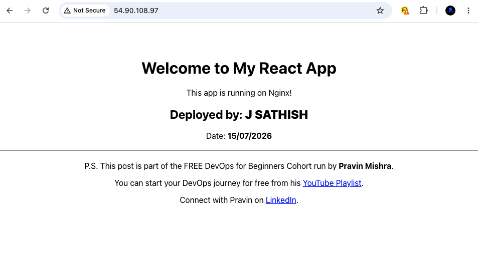

---

#### Screenshot 2 — Output of `ip a`

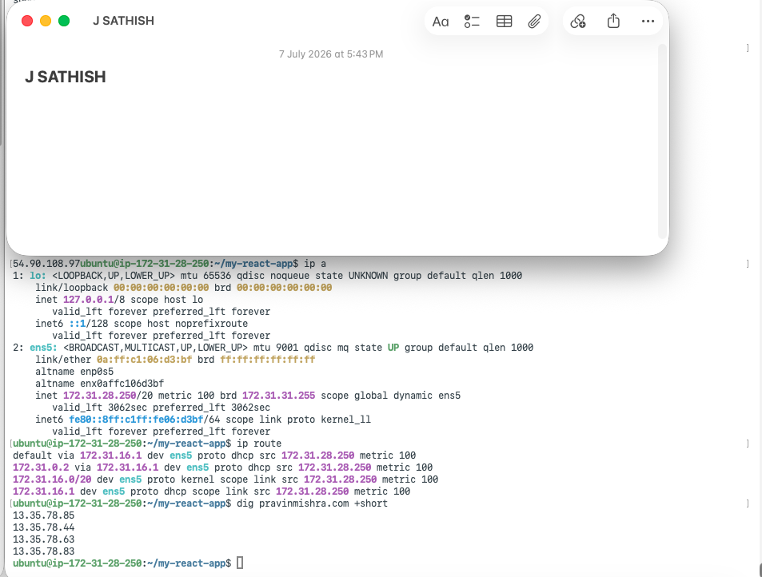

---

#### Screenshot 3 — Output of `sudo ss -tulpen`

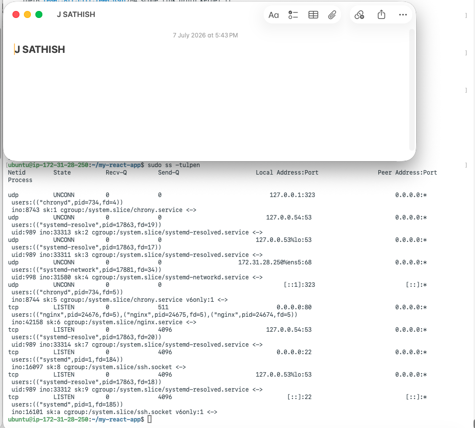

---

#### Screenshot 4 — Output of `sudo ufw status`

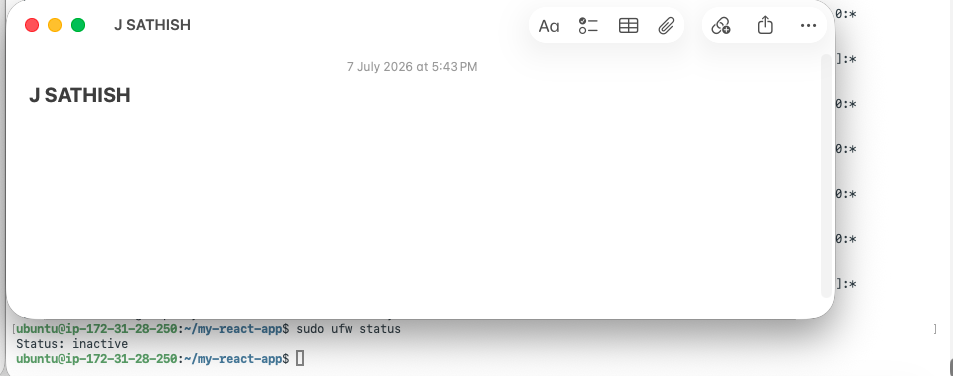

---

### Notes

Answer the following in your own words:

**1. What proves Nginx is listening on 0.0.0.0:80?**

The `sudo ss -tulpen` output showing `tcp LISTEN 0.0.0.0:80 ... nginx` proves that Nginx is listening on port **80**. The address `0.0.0.0` means it is bound to **all network interfaces**, allowing HTTP connections from any IP address, not just `localhost`. The process name **nginx** confirms that Nginx is the service listening on that port.

---

**2. What proves SSH is active on port 22?**

The `sudo ss -tulpen` output showing `tcp LISTEN 0.0.0.0:22 ... sshd` confirms that the **SSH daemon (`sshd`)** is actively listening on **port 22**. The address `0.0.0.0` indicates it is accepting connections on **all network interfaces**, enabling remote SSH access to the server using commands like `ssh ubuntu@<public-ip>`.

---

**3. Did you find any unexpected open ports? Explain briefly.**

No unexpected open ports were found. Besides **Nginx** on **port 80** and **SSH** on **port 22**, the only other listening services were **chronyd** (time synchronization) and **systemd-resolved** (DNS resolution). These services were bound only to **loopback addresses** (`127.0.0.1`, `127.0.0.53`, `127.0.0.54`), making them inaccessible from external networks. This confirms that only the intended services—**HTTP** and **SSH**—are exposed externally.

---

# Task 2 — Service Health & Systemd Validation (Nginx)

## Goal

Verify that Nginx is properly installed, running, enabled at boot, and safely configured.

### Evidence

#### Screenshot 1 — Output of `systemctl status nginx --no-pager`

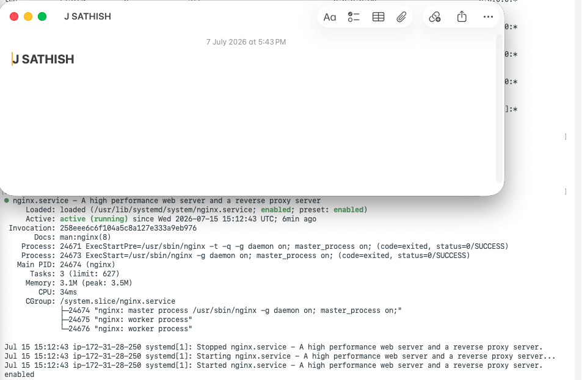

---

#### Screenshot 2 — Output of `sudo nginx -t`

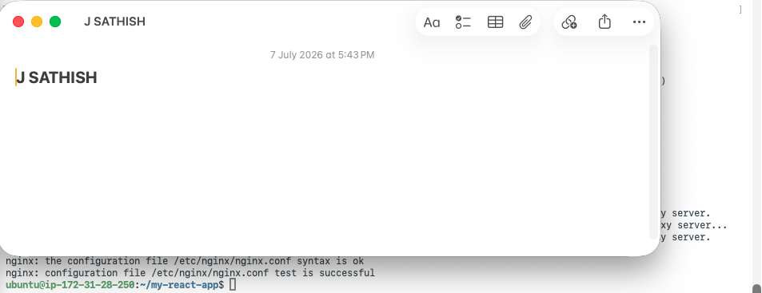

---

#### Screenshot 3 — Output of `sudo ss -lptn '( sport = :80 )'`

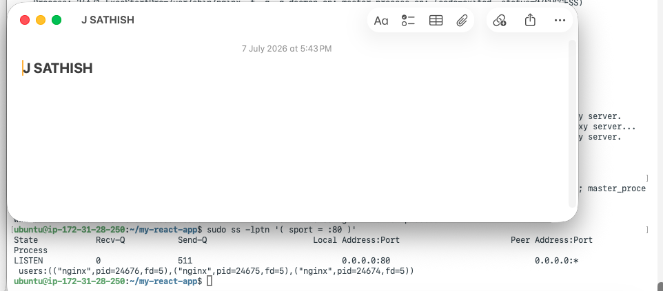

---

### Notes

Answer the following in your own words:

**1. What happens if Nginx fails to restart in production?**

If **Nginx fails to restart** in production, the website becomes **unavailable** because no process will be serving HTTP requests on **port 80**. Users trying to access the site will experience **connection errors or timeouts**. If this occurs during a deployment or configuration change, it can cause downtime until the issue is identified and Nginx is successfully restarted or the configuration is fixed.

---

**2. What's your basic rollback plan?**

A basic rollback plan is:

1. **Validate the configuration** before applying changes by running `sudo nginx -t` to catch syntax errors.
2. If Nginx fails to restart, check the cause using `systemctl status nginx --no-pager` and `sudo journalctl -u nginx --no-pager -n 50`.
3. **Revert to the last known-good configuration** (from a backup or version control), then run `sudo nginx -t` again to verify it.
4. Once the configuration is valid, restart Nginx with `sudo systemctl restart nginx` and confirm the website is accessible.

Keeping a backup of the working configuration before making changes ensures you can quickly restore service if something goes wrong.

---

# Task 3 — Logs & Request Trace

## Goal

Verify real traffic flow and analyze logs to understand system behavior and errors.

### Evidence

#### Screenshot 1 — Output of `sudo tail -n 30 /var/log/nginx/access.log`

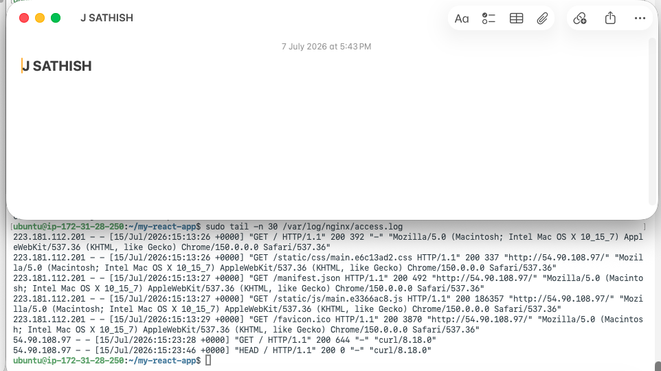

---

#### Screenshot 2 — Output of `sudo tail -n 30 /var/log/nginx/error.log`

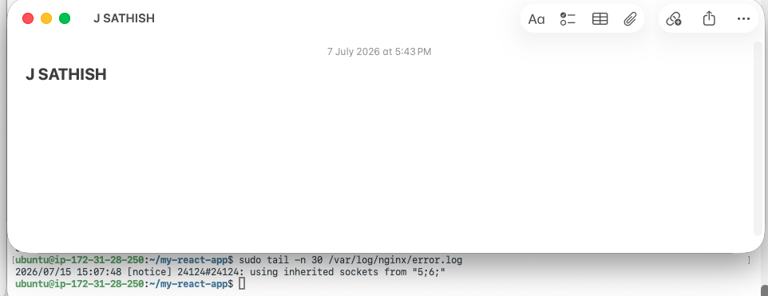

---

#### Screenshot 3 — Output of `sudo journalctl -u nginx --no-pager -n 50`

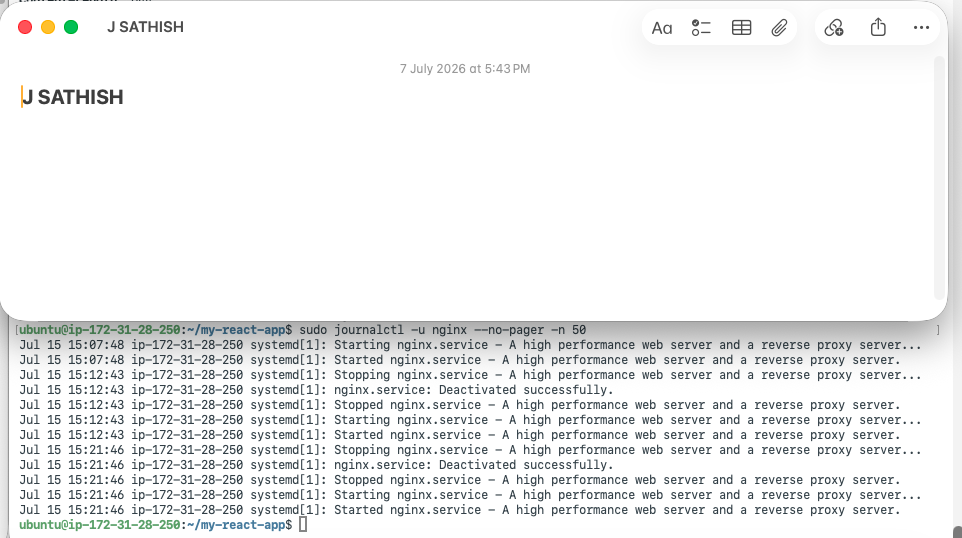

---

### Notes

Answer the following in your own words:

**1. Were there any errors in the logs?**

No errors were found in the logs. The **Nginx error log** contained no error messages, and the `journalctl` output showed only normal events such as **Started**, **Stopped**, **Reloaded**, and **Deactivated successfully**. There were no **Failed** or **Exited with status** messages, indicating that Nginx was operating normally.

---

**2. If there were no errors, what does that indicate about the system?**

An empty error log and a clean `journalctl` history indicate that **Nginx is currently running without errors, misconfigurations, or failed service events** during the period covered by the logs. This suggests the system is healthy and operating as expected. However, it is only a snapshot of the checked timeframe, so regular log monitoring is still important to detect any future issues.

---

**3. Based on the access logs, were your curl requests visible in the log entries? What does that prove about traffic flow?**

Yes. The `curl` request was visible in the **Nginx access log** as a **`GET /`** request with a **200 OK** status and the user agent **`curl/8.18.0`**. This confirms that the request successfully reached Nginx, was processed correctly, and was recorded in the access log, verifying that the web server and logging are functioning as expected.

---

# Task 4 — System Resource Health Check (Capacity Red Flags)

## Goal

Assess server capacity and detect potential performance or failure risks.

### Evidence

#### Screenshot 1 — Output of `uptime`

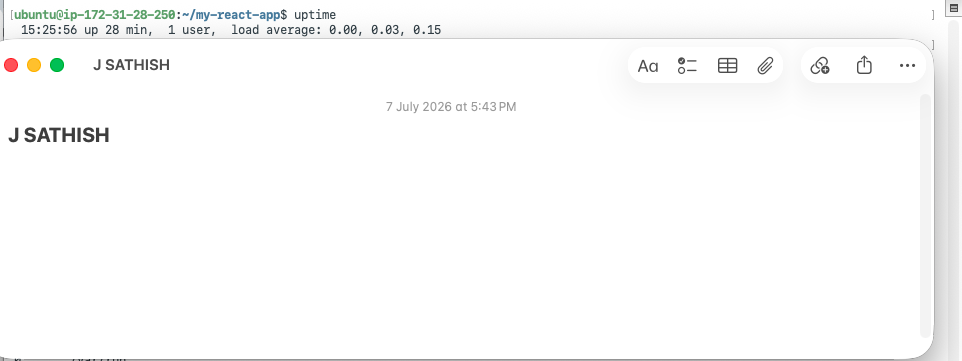

---

#### Screenshot 2 — Output of `free -h`

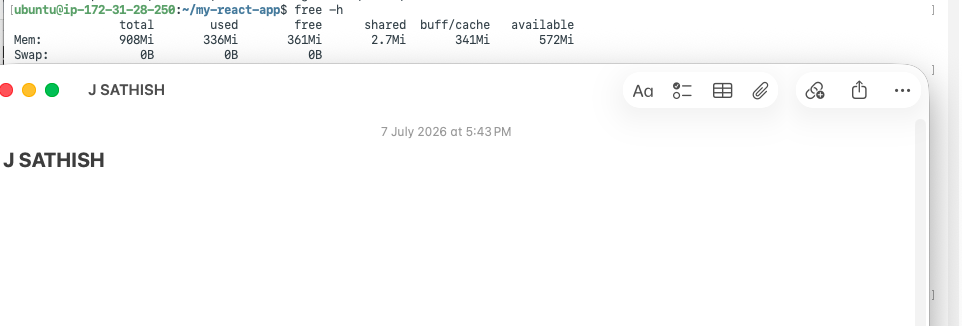

---

#### Screenshot 3 — Output of `df -h`

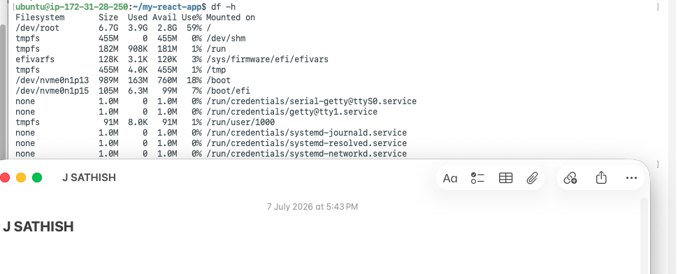

---

#### Screenshot 4 — Output of `sudo du -sh /var/* | sort -h`

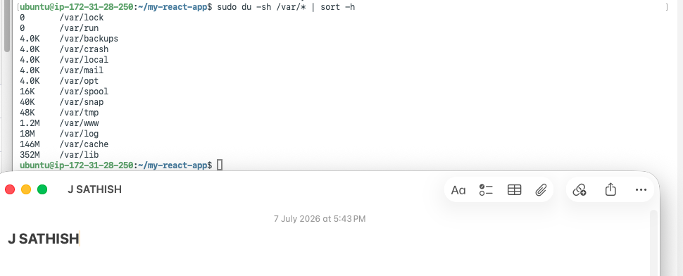

---

### Notes

Answer the following in your own words:

**1. Which resource looks most critical right now? (CPU/load, memory, or disk) Explain why.**

None of the monitored resources appear critical at the moment. **CPU usage is low**, **memory has sufficient free capacity with no swap usage**, and **disk usage is only 61%**, leaving adequate free space. If one resource deserves the closest ongoing monitoring, it is **disk space**, as it can gradually fill over time due to log files, package caches, or application data, potentially causing issues if not monitored regularly.

---

**2. What happens if disk becomes 100% full in a production server?**

If a production server's **disk reaches 100% capacity**, it can cause serious operational issues. **Log files can no longer be written**, making troubleshooting difficult during incidents. Applications, package managers, and other services that need temporary disk space may fail or crash. Databases may refuse new writes or risk data corruption. In severe cases, the operating system itself can become unstable, and even basic tasks such as SSH logins or starting services may fail due to the lack of available disk space.

---

# Task 5 — Configuration & Deployment Verification

## Goal

Ensure the correct React build is deployed and Nginx is serving it properly.

### Evidence

#### Screenshot 1 — Output of `ls -lah /var/www/html | head -n 20`

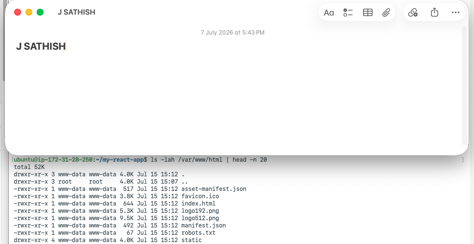

---

#### Screenshot 2 — Output of `grep -R "Deployed by" -n /var/www/html 2>/dev/null | head`

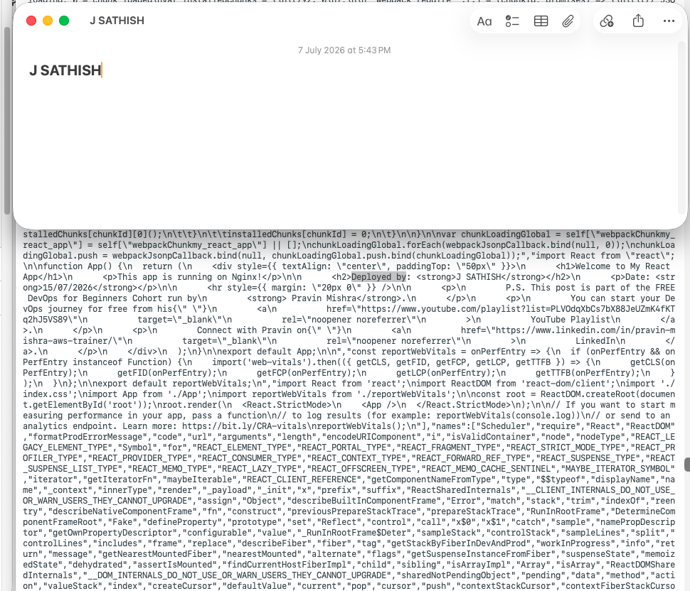

---

#### Screenshot 3 — Output of `grep -n "try_files" /etc/nginx/sites-available/default`

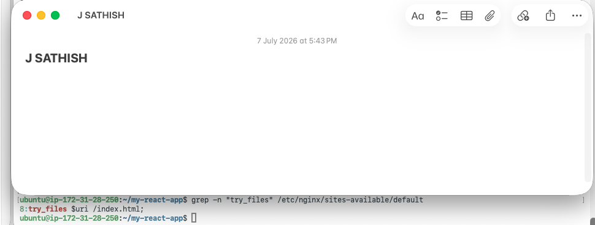

---

### Notes

Answer the following in your own words:

**1. How do you confirm that the correct version of the application is deployed?**

The correct application version was confirmed using multiple verification steps:

* `ls -lah /var/www/html` verified that the expected **React production build** files (`index.html`, `static/`, and other build assets) were present and owned by `www-data`.
* `grep -R "Deployed by"` confirmed that the custom identifier was included in the compiled JavaScript bundle, proving the correct build was deployed.
* `grep -n "try_files"` verified that Nginx is configured to serve `index.html` for unmatched routes, ensuring proper React SPA routing.
* Finally, a `curl` request confirmed that Nginx was serving this deployed build over HTTP, matching the files on disk.

Together, these checks confirm that the correct React frontend version is deployed and being served by Nginx.

---

# Task 6 — Nginx Configuration Failure Simulation

## Goal

Simulate a real-world Nginx misconfiguration and recover the service safely.

### Evidence

#### Screenshot 1 — Output of `sudo nginx -t` showing the syntax error (broken config)

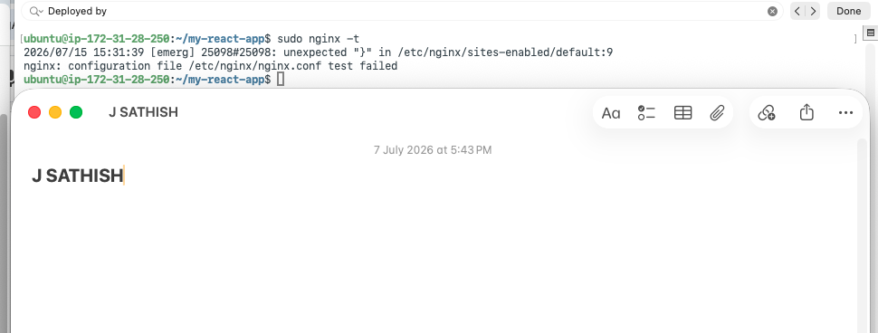

---

#### Screenshot 2 — Output of `sudo nginx -t` showing syntax ok (fixed config)

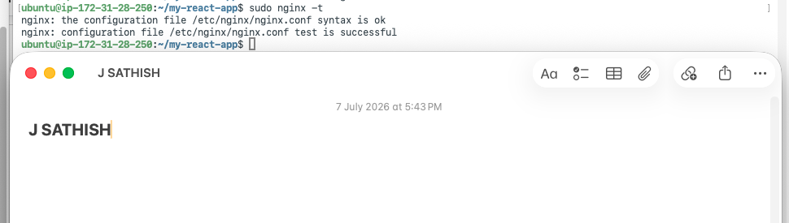

---

#### Screenshot 3 — Output of `curl -I http://<public-ip>` confirming recovery (200 OK)

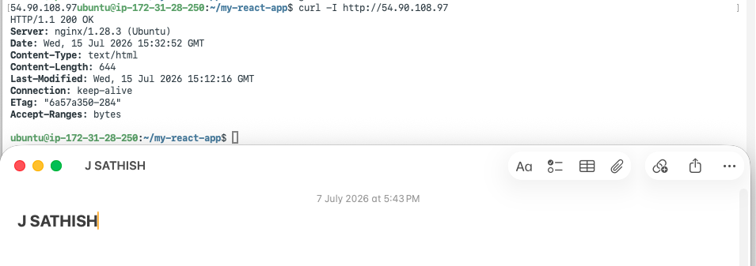

---

### Notes

Answer the following in your own words:

**1. What caused the configuration failure?**

The configuration failure was caused by **missing semicolons** in the Nginx configuration file (`/etc/nginx/sites-available/default`). One semicolon was missing from the `try_files $uri /index.html;` directive, and another was missing from the `error_page 404 /index.html;` directive. These syntax errors prevented Nginx from parsing the configuration, causing the configuration test and restart to fail.

---

**2. How did you fix the issue?**

The issue was fixed by **restoring the missing semicolons** in the Nginx configuration file and saving the changes. The configuration was then validated using `sudo nginx -t` to ensure the syntax was correct. After the test reported **"syntax is ok"** and **"test is successful"**, Nginx was restarted with `sudo systemctl restart nginx`, and a final `curl -I` check confirmed that the application was being served successfully again.

---

**3. How can you avoid this kind of issue in real production systems?**

To avoid this type of issue in production:

* **Always validate the configuration** with `sudo nginx -t` before restarting or reloading Nginx.
* **Keep configuration files in version control** (e.g., Git) so changes can be reviewed and rolled back quickly.
* **Test changes in a staging environment** before deploying them to production.
* **Take a backup** of the working configuration before making any modifications.
* **Use automated deployment pipelines** that run configuration validation and only deploy if all checks pass.

These practices help catch syntax errors early and minimize the risk of production downtime.

---

# Task 7 — Web Application Failure Simulation

## Goal

Simulate missing deployment content and recover the application safely.

### Evidence

#### Screenshot 1 — Output of `curl -I http://<public-ip>` showing failure (non-200 response)

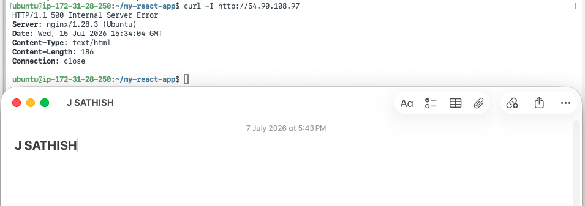

---

#### Screenshot 2 — Output of `curl -I http://<public-ip>` confirming recovery (200 OK)

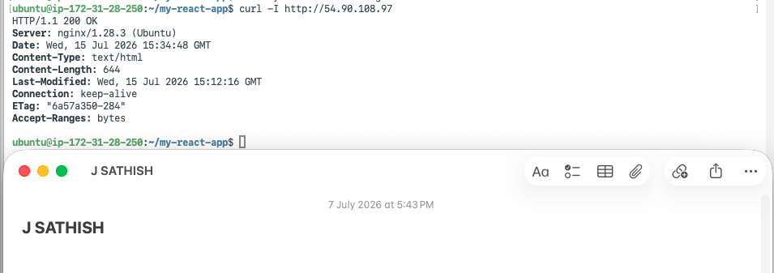

---

### Notes

Answer the following in your own words:

**1. What caused the application to break in this scenario?**

The application broke because the **Nginx web root directory (`/var/www/html`) was emptied**, removing all the deployed React application files. Although Nginx was still running with a valid configuration, it had no `index.html` or other static assets to serve. As a result, requests to the application returned a **500 Internal Server Error** instead of the expected React frontend.

---

**2. How did you fix the issue and restore the application?**

The issue was resolved by **restoring the original deployment** from the backup. The empty web root directory was replaced with the backed-up application files, restoring the React build to `/var/www/html`. Nginx was then restarted to serve the restored content, and a `curl -I` request confirmed successful recovery by returning **HTTP 200 OK**, verifying that the original application was being served correctly again.

---

**3. What steps would you take to prevent this kind of issue in real production systems?**

To prevent this type of issue in production:

* **Create automated backups** before every deployment so the previous version can be restored quickly if needed.
* **Use versioned deployments with a symlink** (e.g., `/var/www/current`) instead of replacing the live directory directly, enabling safe and instant rollbacks.
* **Add CI/CD validation checks** to ensure deployment files, such as `index.html`, exist and are complete before marking the deployment as successful.
* **Implement post-deployment health checks** that verify the application returns a **200 OK** response immediately after deployment, allowing failed releases to be detected and rolled back automatically.

---

# Task 8 — Security & Reliability Review

## Goal

Review and reflect on the security and reliability practices applied during this assignment.

### Security & Reliability Notes

Answer the following in your own words:

**1. Why is SSH key-based authentication more secure than sharing passwords?**

SSH key-based authentication is more secure because it uses a **public/private key pair** instead of a password. The **private key never leaves the client**, making it resistant to interception or theft over the network. It also eliminates the risks of weak, reused, or shared passwords and is far more difficult to brute-force. Additionally, SSH keys can be managed, revoked, and protected with a passphrase for an extra layer of security.

---

**2. Why should only required ports be open on a production server?**

Only the **required ports** should be open on a production server to **minimize the attack surface**. Every open port is a potential entry point for attackers, increasing the risk of unauthorized access or exploitation. Restricting access to only essential services (such as **port 22 for SSH** and **port 80/443 for web traffic**) improves security and reduces exposure to vulnerabilities.

---

**3. Why is it important for Nginx to be enabled on boot?**

Enabling **Nginx on boot** ensures that the web server **starts automatically whenever the server reboots**, such as after maintenance, updates, or unexpected outages. This minimizes downtime and ensures the website becomes available without requiring manual intervention, improving the reliability of the production environment.

---

**4. What are the risks of sharing secrets, keys, or credentials publicly?**

Sharing **secrets, SSH keys, API tokens, or credentials publicly** can lead to **unauthorized access** to servers, applications, or cloud resources. Attackers can use these credentials to steal data, modify or delete systems, deploy malicious software, or incur unexpected costs. To reduce these risks, secrets should be stored securely (e.g., in a secrets manager or vault), never committed to source code, and rotated immediately if they are accidentally exposed.

---

**5. Why should cloud resources be stopped or terminated when they are no longer needed?**

Cloud resources should be **stopped or terminated** when they are no longer needed to **avoid unnecessary costs** and reduce resource waste. Removing unused instances also improves security by eliminating unnecessary attack surfaces and helps keep the cloud environment clean, organized, and easier to manage.

---

# LinkedIn Post (Required)

## Evidence

#### LinkedIn Post URL

Paste your LinkedIn post URL here:

`__________________________`

---

#### Screenshot — Published LinkedIn post

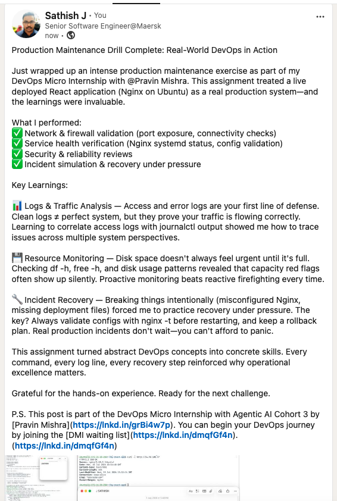

---

# Submission Instructions

- Add all required screenshots in your submission
- Full name must be visible in required screenshots
- Do not expose sensitive information (keys, passwords, account IDs)

---

# Completion Checklist

- ✅ Task 1: Screenshots (browser, ip a, ss -tulpen, ufw status) + Notes answered
- ✅ Task 2: Screenshots (nginx status, nginx -t, ss port 80) + Notes answered
- ✅ Task 3: Screenshots (access log, error log, journalctl) + Notes answered
- ✅ Task 4: Screenshots (uptime, free -h, df -h, du -sh) + Notes answered
- ✅ Task 5: Screenshots (ls html, grep deployed by, grep try_files) + Notes answered
- ✅ Task 6: Screenshots (nginx -t fail, nginx -t pass, curl recovery) + Notes answered
- ✅ Task 7: Screenshots (curl failure, curl recovery) + Notes answered
- ✅ Task 8: Security & Reliability Notes answered
- ✅ LinkedIn post published and URL submitted
- ✅ Full Name visible in all required screenshots
- ✅ No sensitive data exposed

---

## 📌 About DMI & CloudAdvisory

DevOps Micro Internship (DMI) is a project-based DevOps program run by Pravin Mishra (The CloudAdvisory) focused on real-world execution, systems thinking, and career readiness.

It helps learners build strong DevOps foundations with hands-on experience.

---

## 📌 Resources

- 🌐 DMI Official Website: https://pravinmishra.com/dmi  
- 🎓 DevOps for Beginners (Udemy): https://www.udemy.com/course/devops-for-beginners-docker-k8s-cloud-cicd-4-projects/  
- 🎓 Agentic AI DevOps with Claude Code: https://www.udemy.com/course/ultimate-agentic-ai-devops-with-claude-code/  
- 🎓 DevOps with Claude Code: Terraform, EKS, ArgoCD & Helm: https://www.udemy.com/course/devops-with-claude-code-terraform-eks-argocd-helm/  
- ▶️ YouTube Playlist: https://www.youtube.com/playlist?list=PLFeSNDtI4Cho  
- 🔗 Pravin Mishra (LinkedIn): https://www.linkedin.com/in/pravin-mishra-aws-trainer/  
- 🏢 CloudAdvisory (LinkedIn): https://www.linkedin.com/company/thecloudadvisory/

---

*This submission is part of DevOps Micro Internship (DMI) Cohort 3 — Agentic AI Track.*