# Assignment 5 — Bash Script Automation Drill (OPS Checklist)

Part of the DevOps Micro Internship (DMI) Cohort 3 with Agentic AI

---

## Purpose

In this assignment, you will practice Bash scripting by building a series of small automation scripts covering environment setup, variables, arrays, loops, file conditionals, if-else logic, and functions. These scripts form the foundation of real-world Linux automation used in DevOps, cloud, and production support environments.

---

# Task 1 — Bash Environment & Workspace Setup

## Goal

Verify that Bash is available on your system and create a clean workspace for this assignment.

### Evidence

#### Screenshot 1 — Output of `echo $SHELL` and `bash --version`

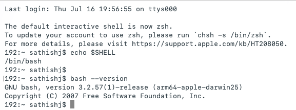

---

#### Screenshot 2 — Output of `pwd` and `ls -lah` showing the scripts directory

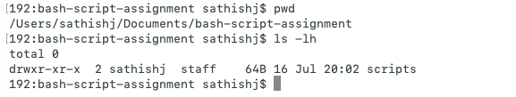

---

### Notes

Answer the following in your own words:

**1. What is Bash?**

**Bash** stands for **Bourne Again Shell**. It is a command-line shell and scripting language used to interact with the Linux operating system. Bash executes commands entered by the user or stored in shell scripts, allowing users to automate tasks and manage the system efficiently. It is the default shell on many Linux distributions and is one of the most widely used Unix shells.

---

**2. What is the difference between shell and Bash?**

A **shell** is a program that provides a command-line interface for interacting with the operating system. **Bash** (Bourne Again Shell) is one specific type of shell. Other popular shells include **sh**, **zsh**, **ksh**, and **fish**. While all shells execute commands and scripts, they differ in their syntax, features, configuration files, and scripting capabilities.

---

**3. Why is it important to confirm the Bash version before writing scripts?**

It is important to confirm the **Bash version** before writing scripts to ensure that Bash is installed and to identify which features and syntax are supported. Different Bash versions may have different capabilities, so verifying the version helps avoid compatibility issues and ensures the script runs correctly on the system.

---

# Task 2 — Your First Bash Script

## Goal

Create your first Bash script, make it executable, and run it from the terminal.

### Evidence

#### Screenshot 1 — Content of `first-script.sh`


---

#### Screenshot 2 — Output of `./first-script.sh`

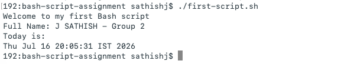

---

#### Screenshot 3 — Output of `ls -l first-script.sh` showing executable permission

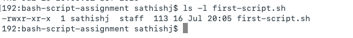

---

### Notes

Answer the following in your own words:

**1. What is the purpose of `#!/bin/bash`?**

The **`#!/bin/bash`** line is called the **shebang** (or hashbang). It tells the operating system to use the **Bash interpreter** located at `/bin/bash` to execute the script. This ensures the script runs with Bash, providing consistent behavior and access to Bash-specific features.

---

**2. Why do we use `chmod +x` before running a script?**

We use **`chmod +x`** to make a script executable. Newly created scripts do not have execute permission by default, so adding it allows the script to be run directly using `./script_name.sh` (for example, `./first-script.sh`) instead of invoking the interpreter manually.

---

**3. What is the difference between running a script using `./script.sh` and `bash script.sh`?**

* **`./script.sh`** runs the script directly. The script **must have execute permission** (`chmod +x`), and the **shebang (`#!/bin/bash`)** determines which interpreter executes it.

* **`bash script.sh`** explicitly tells **Bash** to run the script. In this case, the script **does not need execute permission**, and Bash executes it regardless of the shebang line.

---

# Task 3 — Variables: User Information Script

## Goal

Use variables to store and display user-related information.

### Evidence

#### Screenshot 1 — Content of `user-info.sh`

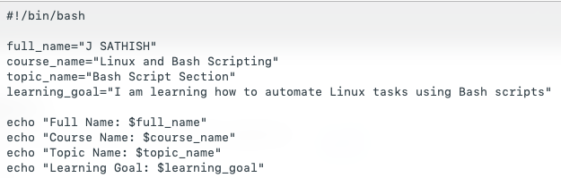

---

#### Screenshot 2 — Output of `./user-info.sh`

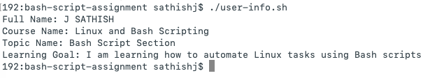

---

### Notes

Answer the following in your own words:

**1. What is a variable in Bash?**

A **variable** in Bash is a named container used to store a value that can be accessed and reused throughout a script. Variables make scripts more flexible and easier to maintain by allowing data, such as a user's name or a file path, to be stored once and referenced whenever needed.

---

**2. Why should we avoid spaces around the `=` sign when creating variables?**

We should **avoid spaces around the `=` sign** because Bash requires variable assignments to have **no spaces**. If spaces are added, Bash interprets the variable name as a command and the rest as its arguments, resulting in an error instead of creating the variable.

**Correct:**

```bash
course_name="Linux and Bash Scripting"
```

**Incorrect:**

```bash
course_name = "Linux and Bash Scripting"
```

In the incorrect example, Bash treats:

* `course_name` → command
* `=` → argument
* `"Linux and Bash Scripting"` → another argument

As a result, the variable is **not created**, and Bash attempts to execute `course_name` as a command.

---

**3. How do you access the value stored inside a Bash variable?**

To access the value stored in a **Bash variable**, prefix the variable name with the **`$`** symbol. This tells Bash to substitute the variable with its stored value.

**Example:**

```bash
echo "$course_name"
```

If:

```bash
course_name="Linux and Bash Scripting"
```

The output will be:

```text
Linux and Bash Scripting
```

---

# Task 4 — Arrays & Loops: Tools Checklist Script

## Goal

Use arrays and loops to print a checklist of tools used in Bash scripting.

### Evidence

#### Screenshot 1 — Content of `tools-checklist.sh`

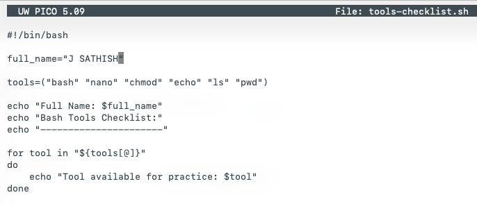

---

#### Screenshot 2 — Output of `./tools-checklist.sh`

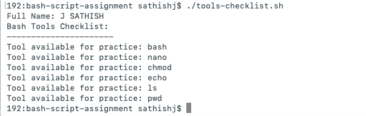

---

### Notes

Answer the following in your own words:

**1. What is an array in Bash?**

A **Bash array** is a variable that can store **multiple values** under a single name. Each value is stored at a different index, making it easy to organize and access related data.

**Example:**

```bash
tools=("bash" "nano" "chmod" "echo" "ls" "pwd")
```

Here, the `tools` array stores six different Linux and Bash commands in a single variable.

---

**2. Why are arrays useful in scripts?**

Arrays are useful because they allow us to **store multiple related values in a single variable**. Instead of creating separate variables for each item, we can keep all the values in one array and process them using loops. This makes scripts **shorter, easier to read, and simpler to maintain and update**.

---

**3. What does `"${tools[@]}"` mean?**

${tools[@]} represents all elements of the tools array. It allows a loop or command to access every value stored in the array.

Example:

Bash

```
for tool in "${tools[@]}"; do
    echo "$tool"
done
```

In this loop, ${tools[@]} expands to each array item one by one, so $tool receives one value at a time.

The double quotes are important because they preserve each array element as a separate item. If an element contains spaces, it will still be treated as a single value rather than being split into multiple words.

---

**4. What is the purpose of the `for` loop in this script?**

The **`for` loop** is used to iterate through each value in the `tools` array one at a time. In each iteration, the current array element is stored in the **`tool`** variable and can be processed or displayed.

For example, during the first iteration, `tool` contains `bash`; in the next, it contains `nano`. The loop continues until all the values in the array have been processed.

---

# Task 5 — Loops: Number Counter Script

## Goal

Use loops to repeat a task multiple times.

### Evidence

#### Screenshot 1 — Content of `counter.sh`

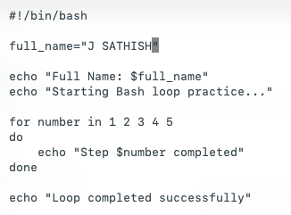

---

#### Screenshot 2 — Output of `./counter.sh`

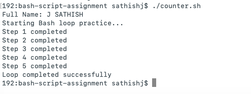

---

### Notes

Answer the following in your own words:

**1. What is a loop?**

A **loop** is a programming construct that repeatedly executes a block of code. It allows you to perform the same task multiple times without writing the same commands repeatedly, making scripts shorter, more efficient, and easier to maintain.

---

**2. Why do we use loops in Bash scripting?**

We use **loops** in Bash scripting to **automate repetitive tasks**. Instead of writing the same commands multiple times, a loop executes them repeatedly, making scripts **shorter, more efficient, and easier to maintain**.

---

**3. How many times did the loop run in your script?**

The loop ran **five times** because the list contained **five values: 1, 2, 3, 4, and 5**. The loop executed **once for each value**, processing them one at a time.

---

**4. What would you change if you wanted the loop to run 10 times?**

To make the loop run **10 times**, include the numbers **1 through 10** in the loop.

```bash
for number in 1 2 3 4 5 6 7 8 9 10
do
    echo "Step $number completed"
done
```

The loop will execute **once for each number**, resulting in a total of **10 iterations**.

---

# Task 6 — Files & Conditionals: File Validation Script

## Goal

Use file checks and conditionals to verify whether files and directories exist.

### Evidence

#### Screenshot 1 — Output of `ls -lah ../test-folder`

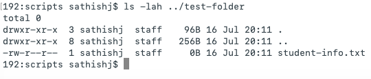

---

#### Screenshot 2 — Content of `file-check.sh`

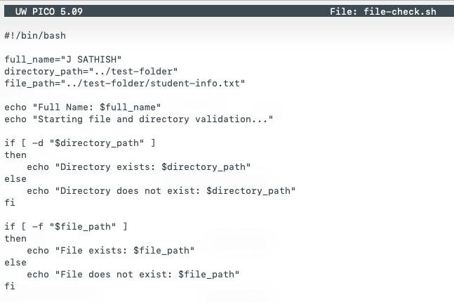

---

#### Screenshot 3 — Output of `./file-check.sh`

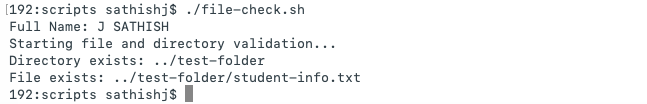

---

### Notes

Answer the following in your own words:

**1. What does `-d` check in Bash?**

The -d option checks whether the given path exists and whether it is a directory. If the directory exists, the condition becomes true.

---

**2. What does `-f` check in Bash?**

The **`-f`** option checks whether a given path **exists** and is a **regular file** (not a directory or other file type). If the file exists and is a regular file, the condition evaluates to **true**.

---

**3. Why should file and directory paths be stored in variables?**

File and directory paths should be stored in **variables** because it makes scripts **easier to read, maintain, and update**. If a path changes, you only need to modify the variable once instead of updating the same path in multiple places throughout the script.

---

**4. What happens if the file does not exist?**

If the file **does not exist**, the **`-f`** test evaluates to **false**. As a result, the commands inside the **`else`** block are executed, and a message such as the following is displayed:

```text
File does not exist: ../test-folder/student-info.txt
```

---

# Task 7 — Conditionals: Pass or Retry Script

## Goal

Use if-else conditionals to make decisions based on a variable value.

### Evidence

#### Screenshot 1 — Content of `score-check.sh` with `score=85`

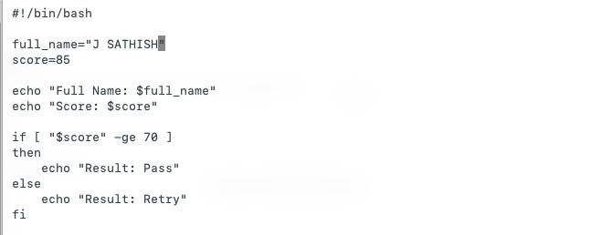

---

#### Screenshot 2 — Output showing `Result: Pass`


---

#### Screenshot 3 — Content of `score-check.sh` with `score=55`

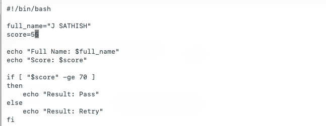

---

#### Screenshot 4 — Output showing `Result: Retry`

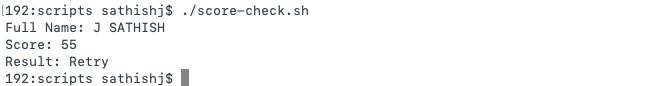

---

### Notes

Answer the following in your own words:

**1. What is the purpose of if-else in Bash?**

The **`if-else`** statement in Bash is used to make decisions based on a condition. If the condition evaluates to **true**, it executes one block of commands. If the condition is **false**, it executes the commands in the **`else`** block, allowing the script to handle different situations.

---

**2. What does `-ge` mean?**

The **`-ge`** operator means **greater than or equal to**. It is used to compare two integer values in a Bash conditional expression.

**Example:**

```bash
[ "$score" -ge 70 ]
```

This condition checks whether the value of the **`score`** variable is **70 or greater**. If it is, the condition evaluates to **true**; otherwise, it evaluates to **false**.

---

**3. Why should conditions be tested with different values?**

Conditions should be tested with **different values** to verify that all possible outcomes work correctly. For example, using **85** tests the **Pass** condition, **55** tests the **Retry** condition, and testing the **boundary value of 70** confirms that the **`-ge`** (greater than or equal to) comparison correctly returns **Pass**.

---

**4. How can conditionals help in automation scripts?**

Conditionals help **automation scripts make decisions** based on the current system state. They allow a script to perform different actions depending on whether a condition is true or false. For example, a script can check if a service is running, a file exists, or disk usage is high, and then automatically take the appropriate action.

---

# Task 8 — Functions: Final Bash Automation Script

## Goal

Create a final Bash script using functions to organize reusable code.

### Evidence

#### Screenshot 1 — Content of `final-automation.sh`

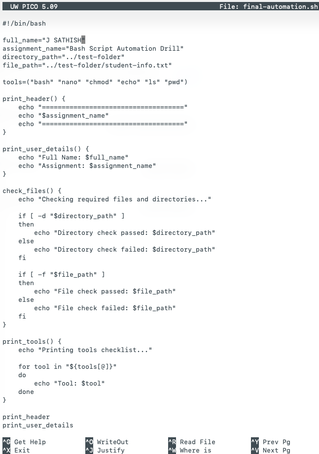
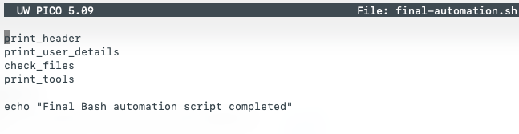
---

#### Screenshot 2 — Output of `./final-automation.sh`

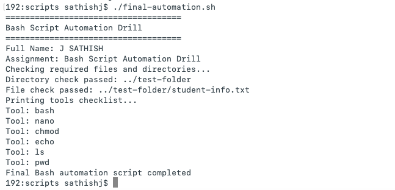

---

#### Screenshot 3 — Output of `ls -lah` showing all created scripts

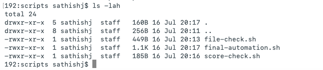

---

### Notes

Answer the following in your own words:

**1. What is a function in Bash?**

A **function** in Bash is a **named block of commands** that performs a specific task. Once a function is defined, it can be called by its name whenever needed, allowing the same code to be reused without rewriting it. This makes scripts **more organized, reusable, and easier to maintain**.
---

**2. Why are functions useful in scripts?**

Functions are useful because they **break a large script into smaller, reusable sections**. This makes the script **easier to read, maintain, and troubleshoot**. If the same task needs to be performed multiple times, you can simply call the function instead of rewriting the same commands, reducing code duplication.

---

**3. Which functions did you create in this script?**

In this script, I created **four functions**:

1. **`print_header`** – Prints the assignment header.
2. **`print_user_details`** – Displays my full name and the assignment name.
3. **`check_files`** – Checks whether the required directory and file exist.
4. **`print_tools`** – Uses a loop to print each tool stored in the array.

Each function performs a specific task, making the script more organized and easier to maintain.

---

**4. How does this final script combine variables, arrays, loops, conditionals, files, and functions?**

The final script combines multiple Bash concepts to create a structured automation script:

* **Variables** store values such as my name, the assignment name, and file or directory paths.
* An **array** stores the list of tool names, and a **loop** iterates through the array to print each tool.
* **Conditionals (`if-else`)** use the **`-d`** and **`-f`** tests to check whether the required directory and file exist, then perform the appropriate action.
* **Functions** organize related commands into reusable sections, which are called in the correct order to execute the complete script.

By combining these features, the script becomes **organized, reusable, and easier to read, maintain, and automate**.

---

# LinkedIn Post (Required)

## Evidence

#### LinkedIn Post URL

Paste your LinkedIn post URL here:

https://www.linkedin.com/posts/sathish-j-80276569_just-completed-my-bash-scripting-mastery-ugcPost-7483543101500821506-o4Ut/?utm_source=share&utm_medium=member_desktop&rcm=ACoAAA6HMEIBTonD7eyzNj3QgU56nWdszIj2pg0

---

#### Screenshot — Published LinkedIn post

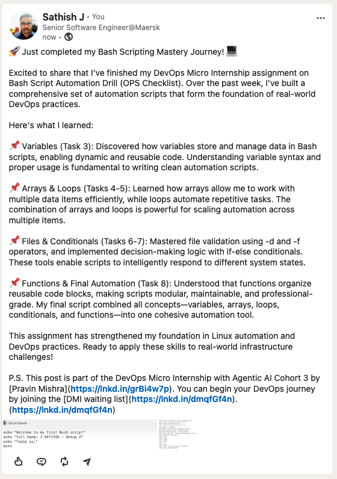

---

# Submission Instructions

- Add all required screenshots in your submission
- Full name must be visible in required screenshots
- All script files must be created and run successfully
- Required notes must be answered clearly for every task
- Do not expose sensitive information (keys, passwords, credentials)

---

# Completion Checklist

- ✅ Task 1: Environment setup verified, workspace created (Screenshots 1–2, Notes answered)
- ✅ Task 2: First script created, executed, permissions verified (Screenshots 1–3, Notes answered)
- ✅ Task 3: Variables script created and run (Screenshots 1–2, Notes answered)
- ✅ Task 4: Arrays and loops script created and run (Screenshots 1–2, Notes answered)
- ✅ Task 5: Counter loop script created and run (Screenshots 1–2, Notes answered)
- ✅ Task 6: File validation script created and run (Screenshots 1–3, Notes answered)
- ✅ Task 7: Pass/Retry conditional script tested with both values (Screenshots 1–4, Notes answered)
- ✅ Task 8: Final automation script created and run (Screenshots 1–3, Notes answered)
- ✅ All scripts run without errors
- ✅ Full Name visible in all required screenshots
- ✅ LinkedIn post published and URL submitted
- ✅ No sensitive data exposed

---

## 📌 About DMI & CloudAdvisory

DevOps Micro Internship (DMI) is a project-based DevOps program run by Pravin Mishra (The CloudAdvisory) focused on real-world execution, systems thinking, and career readiness.

It helps learners build strong DevOps foundations with hands-on experience.

---

## 📌 Resources

- 🌐 DMI Official Website: https://pravinmishra.com/dmi  
- 🎓 DevOps for Beginners (Udemy): https://www.udemy.com/course/devops-for-beginners-docker-k8s-cloud-cicd-4-projects/  
- 🎓 Agentic AI DevOps with Claude Code: https://www.udemy.com/course/ultimate-agentic-ai-devops-with-claude-code/  
- 🎓 DevOps with Claude Code: Terraform, EKS, ArgoCD & Helm: https://www.udemy.com/course/devops-with-claude-code-terraform-eks-argocd-helm/  
- ▶️ YouTube Playlist: https://www.youtube.com/playlist?list=PLFeSNDtI4Cho  
- 🔗 Pravin Mishra (LinkedIn): https://www.linkedin.com/in/pravin-mishra-aws-trainer/  
- 🏢 CloudAdvisory (LinkedIn): https://www.linkedin.com/company/thecloudadvisory/

---

*This submission is part of DevOps Micro Internship (DMI) Cohort 3 — Agentic AI Track.*