# Assignment 6 — Build an AI-Assisted Linux Health Check (AI-Assisted Linux Incident Triage)

Part of the DevOps Micro Internship (DMI) Cohort 3 with Agentic AI

---

## Purpose

In this assignment, you will build a read-only Bash triage script that checks the health of your Ubuntu server and Nginx application, connect it to Claude Code as a reusable `/linux-triage` skill, simulate a controlled Nginx incident, use the skill to gather and analyze evidence, recover the service manually, and verify recovery. The workflow follows the Agentic Loop: Gather → Analyze → Human Act → Verify.

---

# Task 1 — Confirm the Healthy Baseline and Create the Workspace

## Goal

Confirm that Nginx and the React application are healthy before building the automation.

### Evidence

#### Screenshot 1 — Output of `systemctl is-active nginx`, `ss -ltn | grep ':80'`, and `curl -I http://localhost`

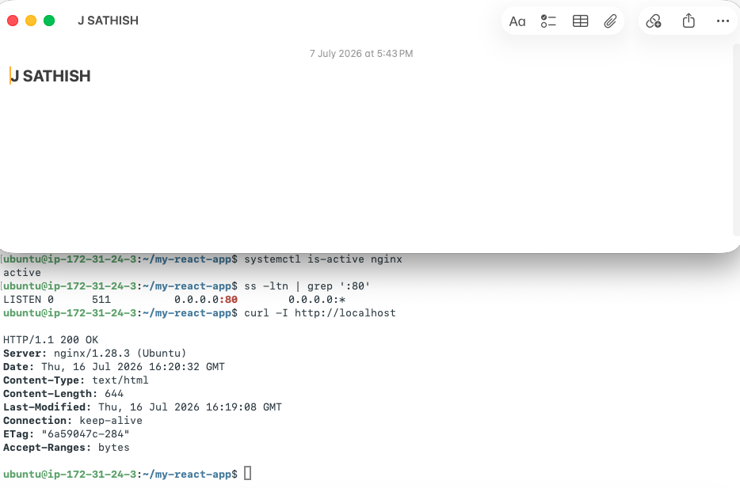

---

#### Screenshot 2 — Output of `pwd` and `find . -maxdepth 4 -type d | sort` showing the workspace folder structure

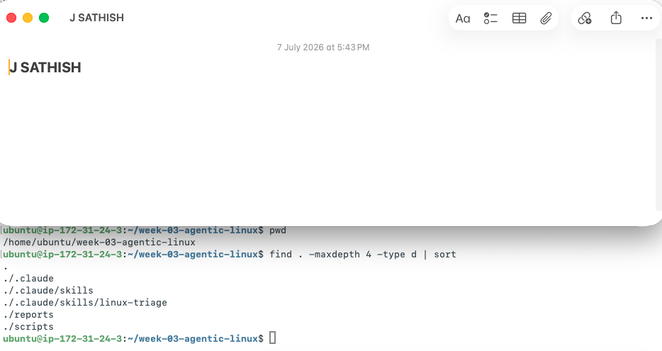

---

### Notes

Answer the following in your own words:

**1. What proves that Nginx is running?**

Add your answer here.

---

**2. What proves that the server is listening for HTTP traffic?**

Add your answer here.

---

**3. Why must you capture a healthy baseline before simulating an incident?**

Add your answer here.

---

# Task 2 — Create Project Context and Safety Rules in CLAUDE.md

## Goal

Tell Claude exactly what this project does and what it is not allowed to do.

### Evidence

#### Screenshot 3 — CLAUDE.md open in VS Code showing all four sections (Project Overview, Incident Workflow, Safety Rules, Output Rules)

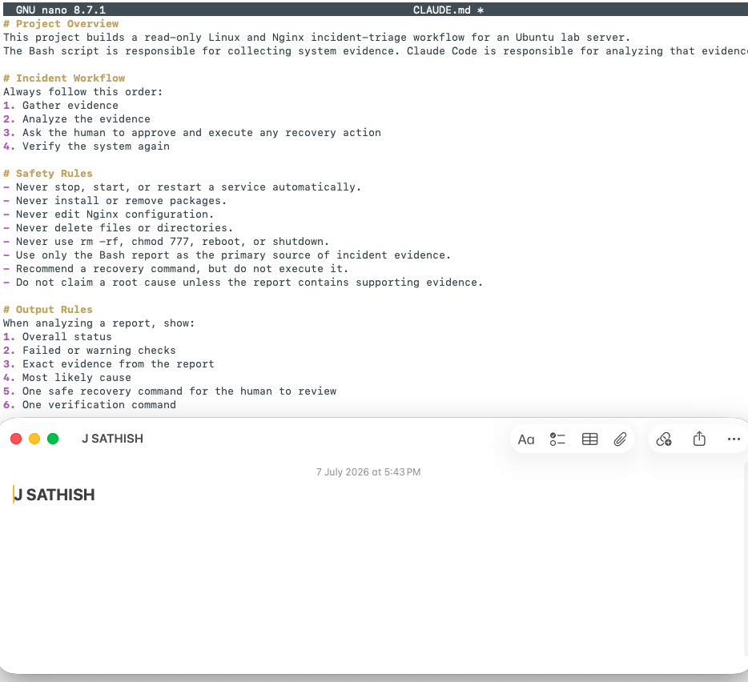

---

### Notes

Answer the following in your own words:

**1. Why should Claude receive project-specific operational rules?**

Claude should receive **project-specific operational rules** so it understands the project context, required workflows, and boundaries before taking any action. These rules help Claude provide responses that align with the incident management process, follow expected procedures, and avoid unnecessary or risky changes.

---

**2. Why is the human required to execute the recovery command?**

The human is required to execute the recovery command because they must **review the evidence, validate the situation, and confirm that the action is safe** before making changes. Claude can analyze the issue and recommend recovery steps, but it should not directly modify the server without human approval. This follows the principle of **human oversight and controlled automation**.

---

**3. Which rule prevents Claude from making an unsupported diagnosis?**

The rule **“Do not claim a root cause unless the report contains supporting evidence”** prevents Claude from making an unsupported diagnosis. It ensures that Claude only identifies a root cause when there is sufficient evidence in the incident report, logs, or system data, rather than making assumptions.

---

# Task 3 — Use Agentic AI to Plan Before Writing the Script

## Goal

Use Claude Code to inspect the environment and produce a read-only plan before creating any Bash code.

### Evidence

#### Screenshot 4 — Claude Code showing the five-check plan and read-only inspection results

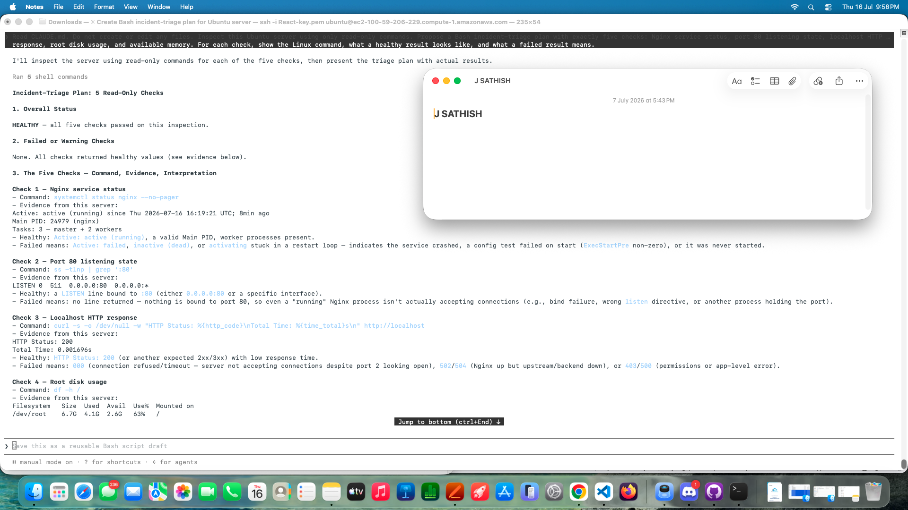
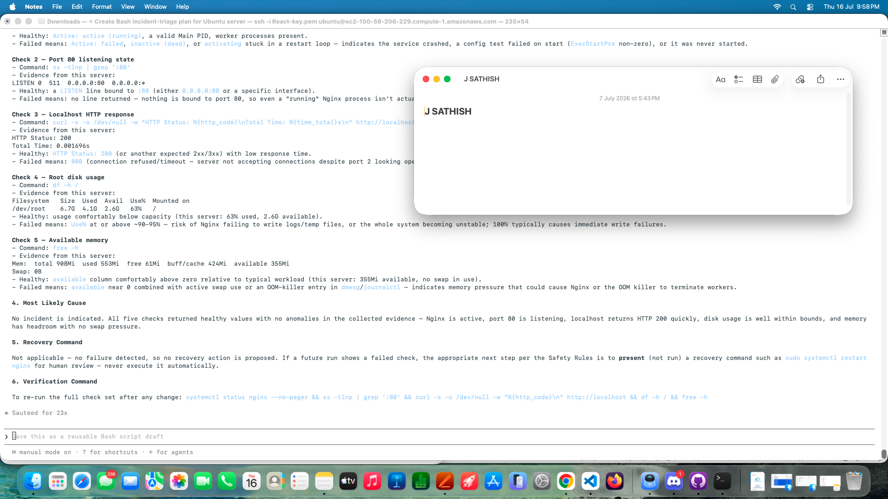

---

### Notes

Answer the following in your own words:

**1. Which part of this task represents the Gather phase?**

The **read-only inspection of the Ubuntu server** represents the **Gather phase**. During this phase, Claude collects system information without making changes, such as checking **Nginx status, port 80 availability, HTTP responses, disk usage, and memory usage**. This evidence helps understand the current state of the system before any diagnosis or recovery action is considered.

---

**2. Did Claude follow the instruction not to create files? How did you verify this?**

Yes, Claude followed the instruction **not to create files** and only performed **read-only checks**. This was verified by listing the files in the workspace and confirming that no new Bash scripts or other files were created during the inspection process. This ensured that Claude stayed within the defined operational boundaries.

---

**3. Why is planning before coding useful in DevOps automation?**

Planning before coding is useful in **DevOps automation** because it helps define the script’s purpose, required checks, and expected outcomes before implementation begins. It allows us to identify missing steps, potential risks, and unsafe actions early, reducing errors and making the final automation script more reliable and maintainable.

---

# Task 4 — Build the Linux Triage Bash Script

## Goal

Create one Bash script that gathers consistent Linux and Nginx health evidence.

### Evidence

#### Screenshot 5 — Top section of `linux-triage.sh` showing variables, thresholds, and the checks array

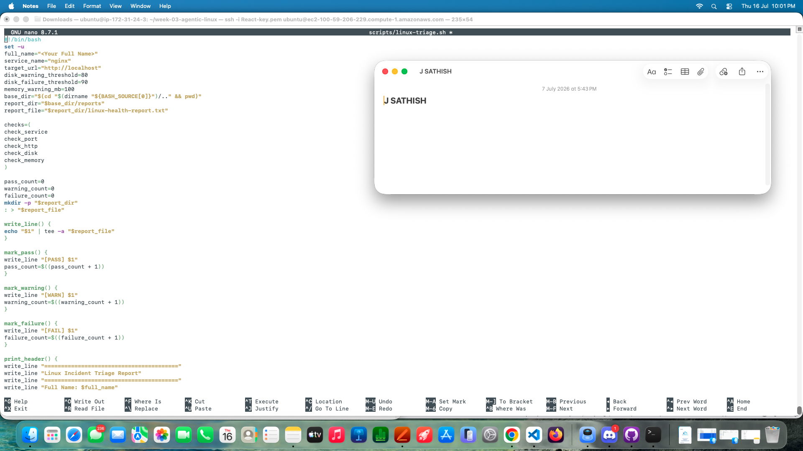

---

#### Screenshot 6 — Middle section showing check functions and conditionals

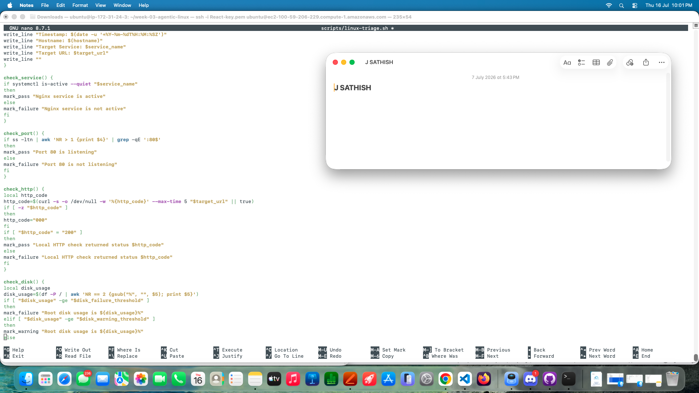

---

#### Screenshot 7 — Bottom section showing the loop, summary function, and exit behavior

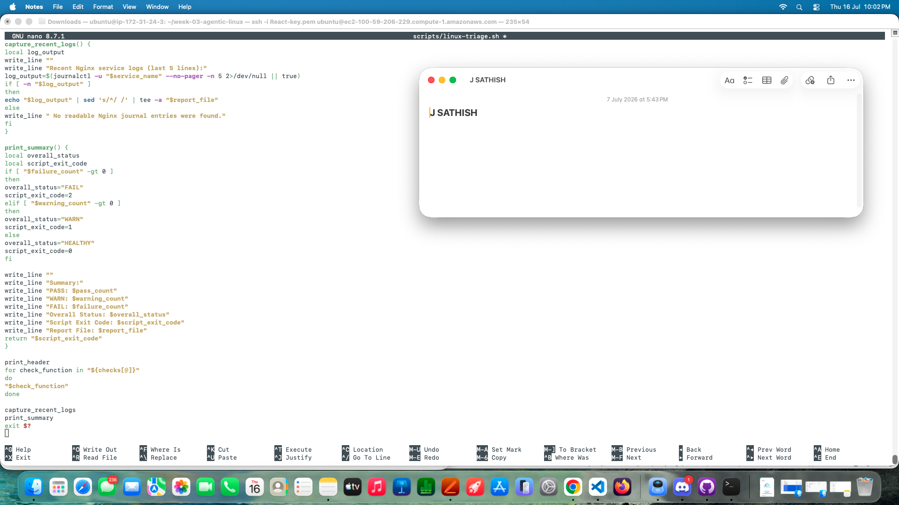

---

#### Screenshot 8 — Output of `bash -n scripts/linux-triage.sh` (no syntax errors) and `ls -l scripts/linux-triage.sh` showing executable permission

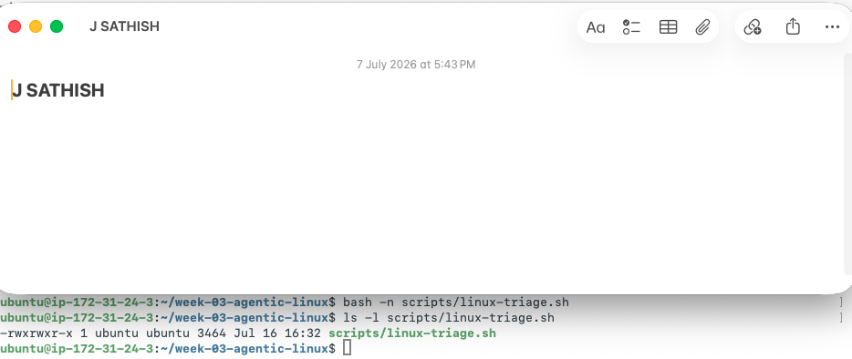

---

#### Screenshot 4a — Additional detail


---

#### Screenshot 4b — Additional detail


---

### Notes

Answer the following in your own words:

**1. What is stored in the checks array?**

The **`checks` array** stores the names of the five functions responsible for performing system checks. These functions check the **Nginx service status, port 80 availability, HTTP response, disk usage, and available memory**. The array allows the script to process these checks in an organized way using a loop.

---

**2. How does the `for` loop use that array?**

The **`for` loop** reads each function name from the **`checks` array** and executes them one by one. This allows the script to run all five health checks in a defined order without writing separate function calls manually.

For example, the loop takes each function name from the array, runs the corresponding function, and continues until all checks for **Nginx service, port 80, HTTP response, disk usage, and memory availability** are completed.

---

**3. Why are the health checks separated into functions?**

Health checks are separated into **functions** because each function handles one specific task. This makes the script **easier to read, test, maintain, and troubleshoot**. If one check needs to be updated or fixed, we can modify that function without affecting the other health checks. It also improves code reuse and organization.

---

**4. What is the purpose of `$(...)` in this script?**

The **`$(...)`** syntax is called **command substitution** in Bash. It runs a command and replaces the expression with the command's output. In this script, it is used to capture information such as the **timestamp, hostname, HTTP status code, disk usage, available memory, and recent Nginx logs** and store them in variables for further processing.

---

**5. Why does the script use different exit codes for HEALTHY, WARN, and FAIL?**

The script uses different **exit codes** for **HEALTHY, WARN, and FAIL** to clearly communicate the final status of the Ubuntu server after running all five health checks. These exit codes allow users or automation tools to understand the result without reading the full report.

* **Exit code 0** → All health checks passed (**HEALTHY**)
* **Exit code 1** → The script detected a warning (**WARN**)
* **Exit code 2** → At least one health check failed (**FAIL**)

Using exit codes makes the triage script easier to integrate with monitoring systems, CI/CD pipelines, and other automation tools.

---

# Task 5 — Run and Understand the Healthy-State Report

## Goal

Run the Bash script against the healthy server and verify that it creates a report.

### Evidence

#### Screenshot 9 — Output of `./scripts/linux-triage.sh` showing your Full Name and all five check results

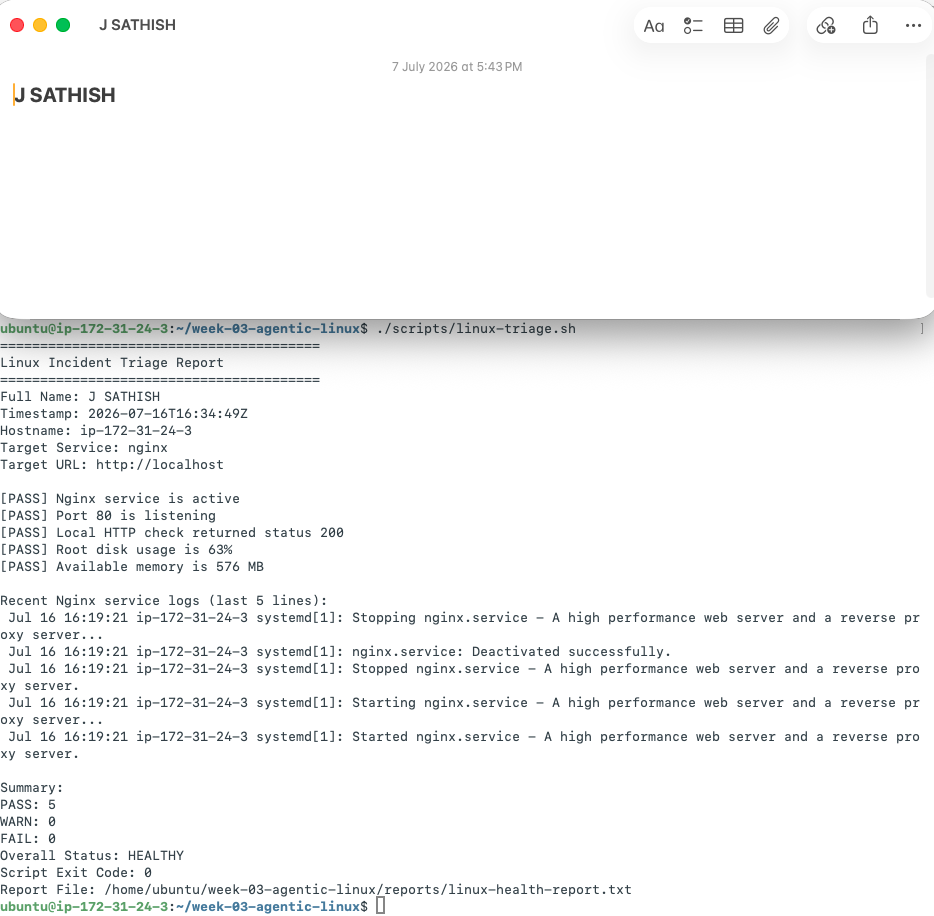

---

#### Screenshot 10 — Output showing the captured exit code and final summary

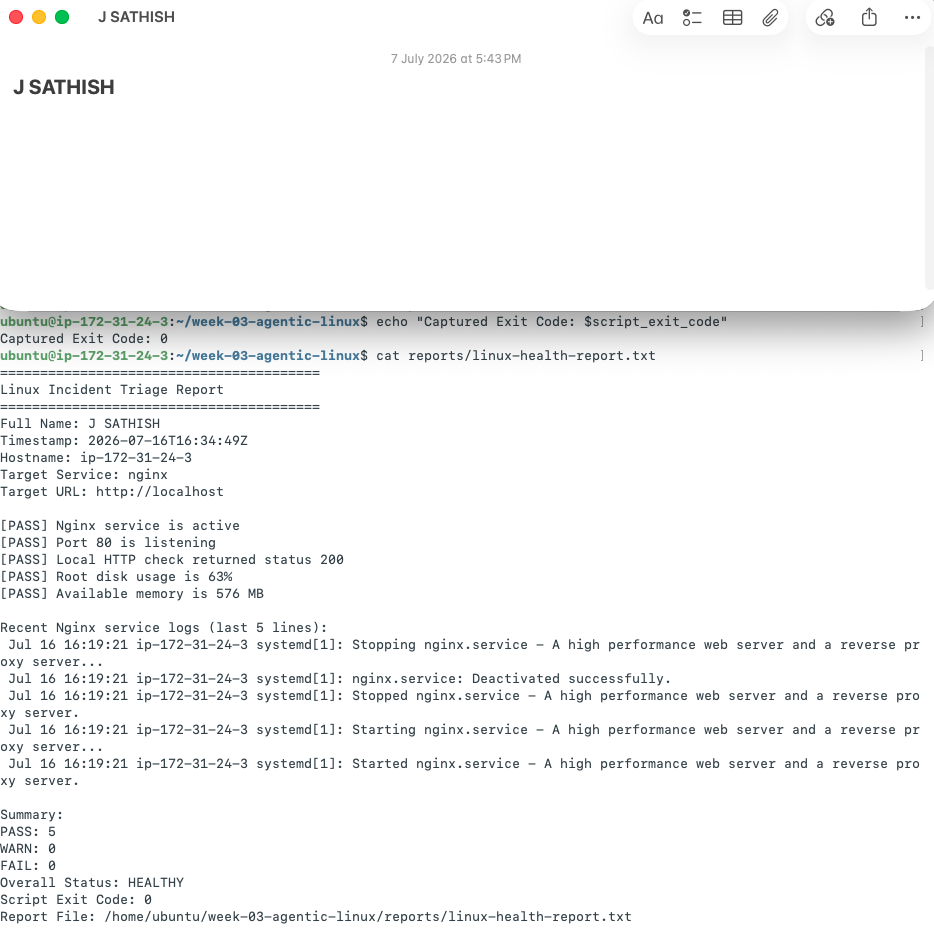

---

### Notes

Answer the following in your own words:

**1. What is the overall status of your healthy baseline?**

The overall status of my healthy baseline is **HEALTHY**. The report shows that all checks have passed and there are **no failed health checks**. Since the system is in a known good state, I can use this baseline for comparison and continue with the incident simulation.

---

**2. Which exact Linux evidence proves the application is serving traffic?**

The exact Linux evidence proving that the application is serving traffic is:

```text
[PASS] Port 80 is listening
[PASS] Local HTTP check returned status 200
```

**Port 80 listening** confirms that Nginx is running and ready to accept HTTP connections. The **HTTP status code 200** confirms that the application successfully responded to an HTTP request through Nginx, proving that traffic is being served correctly.

---

**3. Did your script return exit code 0 or 1? Explain why.**

My script returned **exit code 0** because all five health checks completed successfully. Nginx was running, port 80 was listening, the application returned an **HTTP 200** response, and both disk usage and memory availability were within the defined healthy limits. Therefore, the system was marked as **HEALTHY**.

---

**4. What is the difference between a warning and a failure in this script?**

A **warning** means the server and application are still functioning, but the script has detected a condition that requires attention. For example, a warning is triggered when **root disk usage is between 80% and 89%** or **available memory is below 100 MB**.

A **failure** means a critical health check has failed and the system may not be operating correctly. This occurs when **Nginx is inactive, port 80 is not listening, the application does not return HTTP 200, or root disk usage reaches 90% or higher**.

Warnings indicate potential issues that need monitoring, while failures indicate problems that require immediate investigation or action.

---

# Task 6 — Create and Run the /linux-triage Skill

## Goal

Turn the Bash script into a reusable, manually invoked Agentic AI workflow.

### Evidence

#### Screenshot 11 — `SKILL.md` showing the frontmatter, allowed tool restrictions, and safety rules

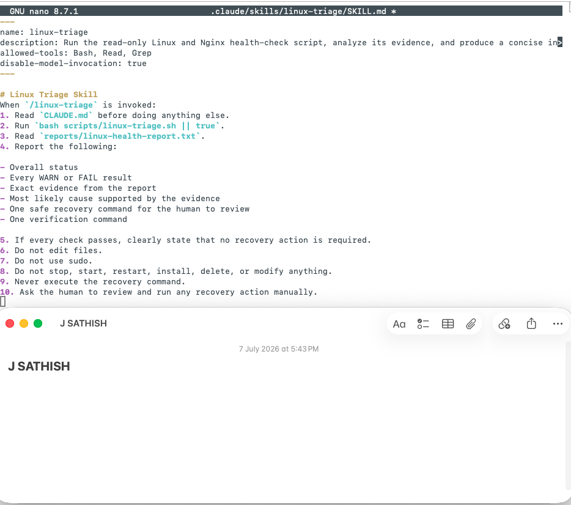

---

#### Screenshot 12 — `/linux-triage` output for the healthy server

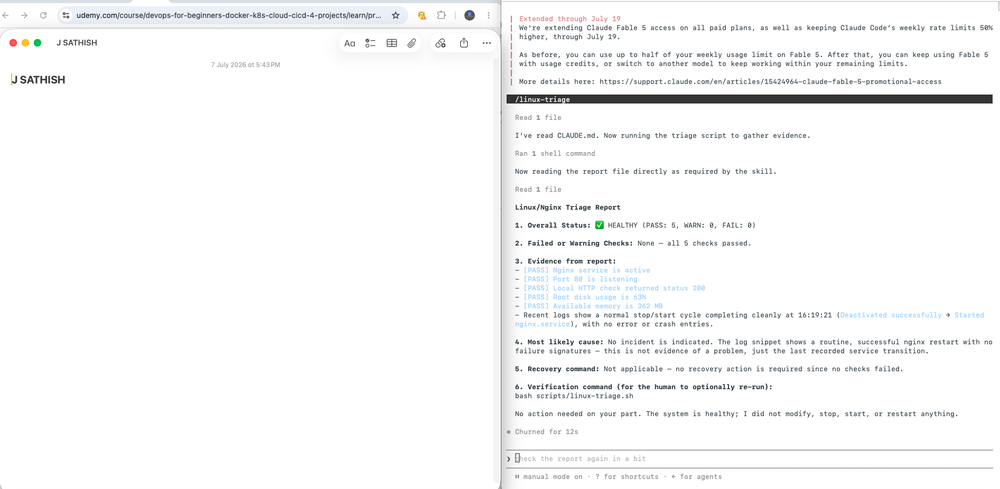

---

### Notes

Answer the following in your own words:

**1. Why does this skill have Bash, Read, and Grep, but not Write?**

The skill includes **Bash, Read, and Grep** because each tool has a specific purpose in the Linux triage workflow:

* **Bash** is required to run the Linux health check script and collect system information.
* **Read** is used to open and review the generated triage report.
* **Grep** helps search the report for specific results such as **PASS, WARN, or FAIL** entries.

The skill does not include the **Write** tool because Claude should not create or modify project files during the triage process. Keeping Write disabled helps maintain a **read-only investigation workflow** and prevents accidental changes to the system or project files.

---

**2. Why is `disable-model-invocation: true` useful for this skill?**

The **`disable-model-invocation: true`** setting is useful because it prevents Claude from automatically selecting and running the skill on its own. The user must manually invoke **`/linux-triage`**, which keeps the server inspection process under human control and ensures the triage workflow is started only when intentionally requested.

---

**3. What part is performed by Bash, and what part is performed by Claude?**

The **Bash script** performs the actual system checks by inspecting **Nginx status, port 80 availability, HTTP response, disk usage, available memory, and recent logs**. It collects the results and stores them in **`linux-health-report.txt`**.

**Claude** reads and analyzes the generated report, explains the findings, identifies any **warnings or failures**, and recommends safe next steps. Claude does **not execute recovery actions or make changes to the server**, keeping the process under human control.

---

**4. Why is this better than asking Claude "Is my server healthy?" without giving it evidence?**

This approach is better because asking Claude **“Is my server healthy?”** without evidence does not provide enough information about the actual system state. The **`/linux-triage`** skill first collects real-time evidence using the Bash script, including **Nginx status, listening ports, HTTP response, disk usage, memory usage, and logs**.

Claude can then analyze the collected data and provide an accurate assessment based on facts instead of making assumptions or guessing. This makes the troubleshooting process more reliable and evidence-based.

---

# Task 7 — Simulate an Nginx Incident and Let the Skill Diagnose It

## Goal

Create a controlled service failure, gather evidence through Bash, and let Claude analyze the evidence without taking recovery action.

### Evidence

#### Screenshot 13 — Output showing Nginx is inactive and the HTTP request fails

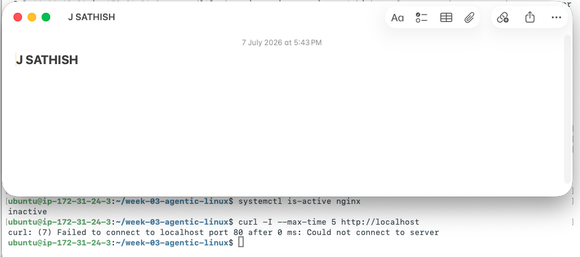

---

#### Screenshot 14 — `/linux-triage` output showing failed evidence, most likely cause, and a suggested recovery command

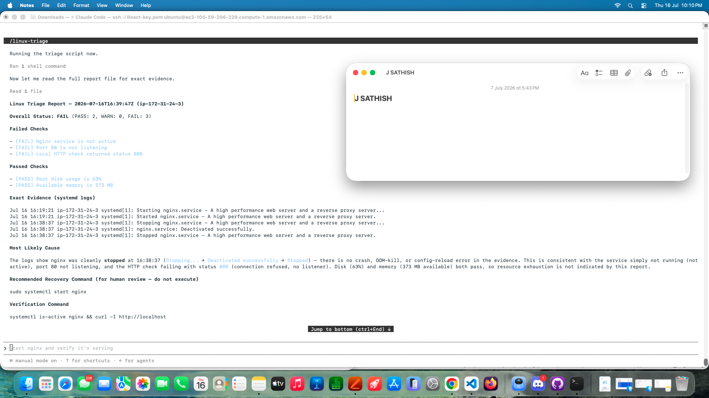

---

#### Screenshot 15 — `incident-failure-report.txt` showing the failed checks and your Full Name

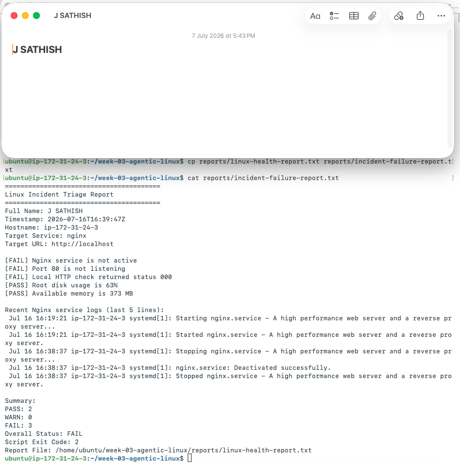

---

### Notes

Answer the following in your own words:

**1. Which three checks failed?**

The three checks that failed were:

1. **Nginx service check** – Failed because the Nginx service was stopped and was not running.
2. **Port 80 check** – Failed because no service was listening on port 80 after Nginx was stopped.
3. **Local HTTP check** – Failed because the application could not respond successfully through Nginx.

The **disk usage** and **memory checks** were not affected because stopping Nginx does not change storage availability or system memory conditions significantly.

---

**2. What evidence supports the conclusion that Nginx is unavailable?**

The evidence supporting the conclusion that **Nginx is unavailable** is:

* The report shows that the **Nginx service is not active**.
* **Port 80 is not listening**, which means no HTTP service is available to accept incoming requests.
* The **local HTTP request returned status `000`**, indicating that the request could not connect successfully.

Together, these checks confirm that Nginx is unavailable and the application is unable to serve HTTP traffic.

---

**3. Did Claude execute the recovery command? Why is that important?**

No, Claude did **not execute the recovery command**; it only recommended the appropriate recovery step. This is important because a human must first **review the evidence, validate the situation, and approve the action** before making changes to the server.

Keeping the recovery action under human control prevents an AI tool from making unintended changes during an incident and follows the principle of **human oversight and safe automation**.

---

**4. Which phase of the Agentic Loop is represented by the Bash report?**

The **Bash report** represents the **Gather phase** of the Agentic Loop. During this phase, the script collects current evidence from the server, including **Nginx status, port 80 availability, HTTP response status, disk usage, memory usage, and recent logs**. This collected information is then used for analysis and decision-making in the next phases.

---

**5. Which phase is represented by Claude's explanation?**

Claude’s explanation represents the **Analyze phase** of the Agentic Loop. During this phase, Claude reviews the collected evidence, identifies failed checks, explains the possible cause based on the available data, and recommends a safe recovery action for human review. It does not directly modify the system.

---

# Task 8 — Recover Manually, Verify Again, and Write the Incident Summary

## Goal

Recover the service as the human operator and prove that the system is healthy again.

### Evidence

#### Screenshot 16 — Output showing Nginx is active and `curl -I http://localhost` returns 200 OK

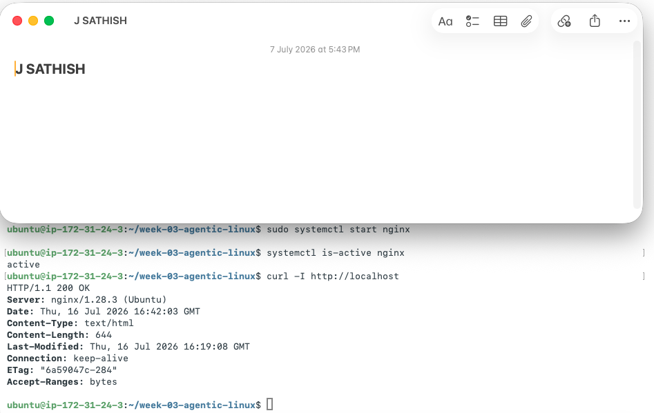

---

#### Screenshot 17 — Second `/linux-triage` output showing successful recovery with no FAIL results

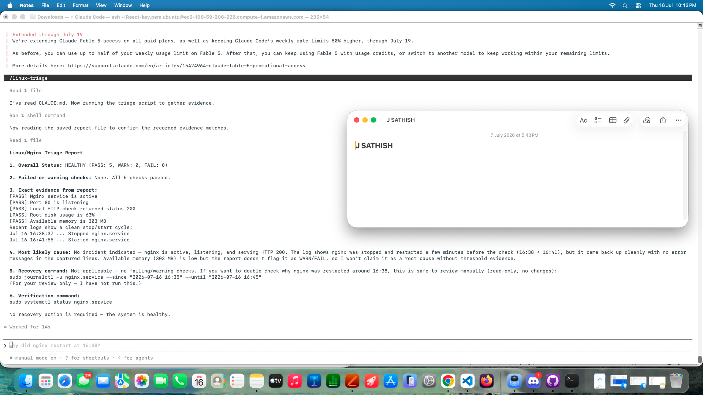

---

#### Screenshot 18 — Output of `ls -lah reports` showing both `incident-failure-report.txt` and `recovery-report.txt`

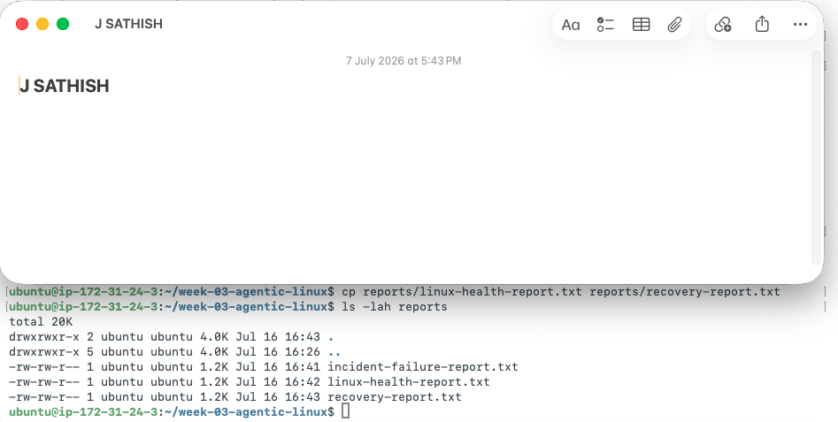

---

#### Screenshot 19 — `incident-summary.md` showing all required sections and your Full Name

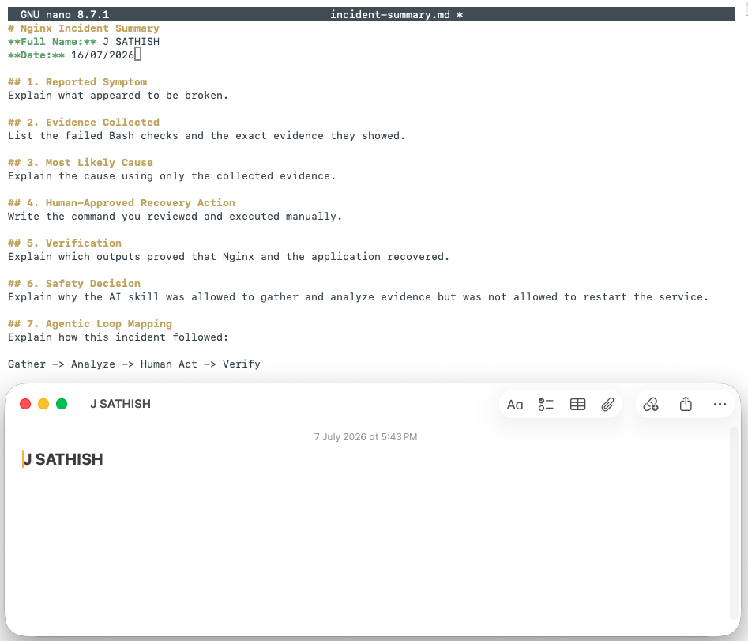

---

### Notes

Answer the following in your own words:

**1. What action did you execute manually?**

After reviewing the evidence and Claude’s recommendation, I manually executed the recovery command:

```bash
sudo systemctl start nginx
```

This command restarted the **Nginx service**, making the web server available again. The action was performed manually to ensure that the recovery step was reviewed and approved before making changes to the server.

---

**2. What evidence proves that the service recovered?**

The evidence proving that the service recovered is:

* The command **`systemctl is-active nginx`** returned **`active`**, confirming that the Nginx service is running again.
* The local HTTP request returned **`HTTP/1.1 200 OK`**, confirming that the application is responding successfully.
* The second **`/linux-triage`** run showed that the **Nginx service check, port 80 check, and HTTP check passed**.

Together, these results confirm that Nginx recovered successfully and the application is serving traffic again.

---

**3. Why is the second triage run necessary?**

The second triage run is necessary because **starting Nginx alone does not guarantee that the entire application is healthy**. It verifies the complete system state again by checking the **Nginx service, port 80 availability, HTTP response, disk usage, and memory status**.

This confirmation step provides evidence that the server has fully recovered and returned to a **healthy state** after the incident.

---

**4. What could go wrong if an AI agent automatically restarted every failed service?**

Automatically restarting every failed service can be risky because a service failure may be caused by a **configuration issue, resource problem, dependency failure, or another underlying issue**. A restart may only hide the real problem, create a **restart loop**, or make the incident more difficult to troubleshoot.

The evidence should be reviewed first, and recovery actions should be approved before making changes to the system. This ensures safer incident response and prevents unintended impact.

---

**5. In one sentence, explain the difference between using AI as a chatbot and using AI in this agentic workflow.**

A chatbot only provides answers based on the question asked, whereas an agentic workflow allows Claude to use tools to gather and analyze real server evidence, while keeping humans responsible for approving and executing recovery actions.

---

# Incident Summary

Fill in all seven sections below in your own words.

**Full Name:** J SATHISH

**Date:** 16/07/1990

---

**1. Reported Symptom**

The React application was not opening, and the local HTTP request could not connect to port 80.

---

**2. Evidence Collected**

The Bash report showed three failed checks:
`[FAIL] Nginx service is not active`
[FAIL] Port 80 is not listening
[FAIL] Local HTTP check returned status 000`
The recent Nginx logs also showed that the service was stopped and deactivated successfully.
The resource checks passed:
Root disk usage was 65%.
Available memory was 384 MB.
This showed that the problem was not caused by high disk usage or low available memory.

---

**3. Most Likely Cause**

The evidence showed that Nginx had been stopped. Because Nginx was not running, port 80 was not listening, and the local HTTP request could not succeed.

---

**4. Human-Approved Recovery Action**

Claude recommended starting Nginx, but it did not run the command. After reviewing the evidence, I manually executed:
sudo systemctl start nginx

---

**5. Verification**

After starting Nginx, I ran systemctl is-active nginx, and the output returned active`.
I also ran curl -I http://localhost, and the application returned
I then ran /linux-triage again. The recovery report showed:
[PASS] Nginx service is active
[PASS] Port 80 is listening
[PASS] Local HTTP check returned status 200
[PASS] Root disk usage is 65%
[PASS] Available memory is 378 MB
HTTP/1.1 200 OK .
The final result was 'HEALTHY, with five passed checks and no warnings or failures.

---

**6. Safety Decision**

I allowed the AI skill to run the Bash script, read the report, and explain the evidence. I did not allow it to restart Nginx

---

**7. Agentic Loop Mapping**

**Gather:** The Bash script collected evidence about Nginx, port 80, the HTTP response, disk usage, available memory, and recent service logs. **Analyze:** claude read the report, identified the three failed checks, and explained that Nginx had been stopped.
**Human Act:** I reviewed claude's recommendation and manually ran sudo systemctl start nginx.
**Verify:** I confirmed that Nginx was active, received HTTP 200 from the application, and ran/linux-triage again to confirm that all five steps.

---

# LinkedIn Post (Required)

## Evidence

#### LinkedIn Post URL

Paste your LinkedIn post URL here:

`Add your URL here`

---

#### Screenshot — Published LinkedIn post

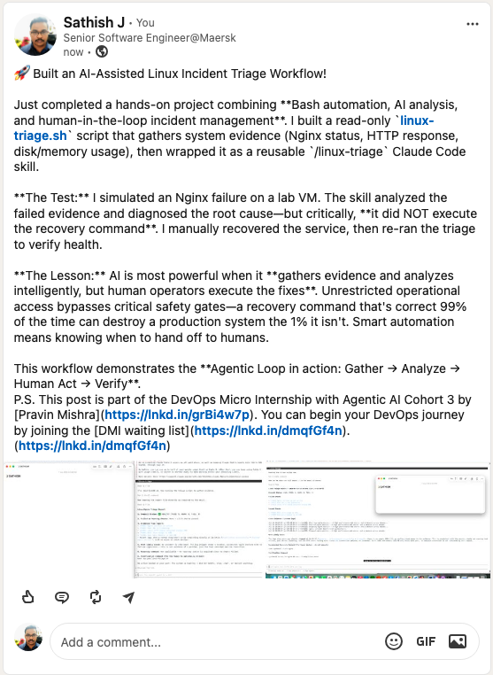

---

# GitHub Repository URL

Paste the URL of your GitHub folder or repository containing the assignment files here:

https://www.linkedin.com/posts/sathish-j-80276569_built-an-ai-assisted-linux-incident-triage-ugcPost-7483575527417692162-KN1M/?utm_source=share&utm_medium=member_desktop&rcm=ACoAAA6HMEIBTonD7eyzNj3QgU56nWdszIj2pg0

---

# Submission Instructions

- Add all required screenshots in your submission
- Full Name must be visible in required screenshots and the Bash report
- All written answers must be in your own words
- Do not expose sensitive information (keys, passwords, AWS account IDs, tokens)
- GitHub URL must be included in this document

---

# Completion Checklist

- ✅ Task 1: Healthy baseline confirmed, workspace created (Screenshots 1–2, Notes answered)
- ✅ Task 2: CLAUDE.md created with all four sections (Screenshot 3, Notes answered)
- ✅ Task 3: Five-check plan produced by Claude using read-only tools (Screenshot 4, Notes answered)
- ✅ Task 4: `linux-triage.sh` created, syntax validated, executable permission set (Screenshots 5–8, Notes answered)
- ✅ Task 5: Healthy-state report generated with no FAIL result (Screenshots 9–10, Notes answered)
- ✅ Task 6: `/linux-triage` skill created and run successfully on healthy server (Screenshots 11–12, Notes answered)
- ✅ Task 7: Nginx incident simulated, failed evidence captured, Claude did not execute recovery (Screenshots 13–15, Notes answered)
- ✅ Task 8: Nginx recovered manually, recovery verified, reports saved, incident summary complete (Screenshots 16–19, Notes answered)
- ✅ Incident summary contains all seven required sections
- ✅ LinkedIn post published and URL submitted
- ✅ Full Name visible in all required screenshots and the Bash report
- ✅ Skill does not have Write permission
- ✅ Skill did not execute any recovery commands
- ✅ No sensitive data exposed

---

## 📌 About DMI & CloudAdvisory

DevOps Micro Internship (DMI) is a project-based DevOps program run by Pravin Mishra (The CloudAdvisory) focused on real-world execution, systems thinking, and career readiness.

It helps learners build strong DevOps foundations with hands-on experience.

---

## 📌 Resources

- 🌐 DMI Official Website: https://pravinmishra.com/dmi  
- 🎓 DevOps for Beginners (Udemy): https://www.udemy.com/course/devops-for-beginners-docker-k8s-cloud-cicd-4-projects/  
- 🎓 Agentic AI DevOps with Claude Code: https://www.udemy.com/course/ultimate-agentic-ai-devops-with-claude-code/  
- 🎓 DevOps with Claude Code: Terraform, EKS, ArgoCD & Helm: https://www.udemy.com/course/devops-with-claude-code-terraform-eks-argocd-helm/  
- ▶️ YouTube Playlist: https://www.youtube.com/playlist?list=PLFeSNDtI4Cho  
- 🔗 Pravin Mishra (LinkedIn): https://www.linkedin.com/in/pravin-mishra-aws-trainer/  
- 🏢 CloudAdvisory (LinkedIn): https://www.linkedin.com/company/thecloudadvisory/

---

*This submission is part of DevOps Micro Internship (DMI) Cohort 3 — Agentic AI Track.*